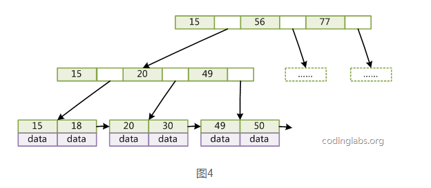

####  二叉查找树 BST
* 任意节点，节点左边所有的值小于等于根节点
* 任意节点，节点右边的值大于根节点

局限性:
某些情况，BST会退化成一个有n个节点的线性链，降低了查找效率，进而引出AVL 平衡二叉查找树  
<!--more-->


#### 平衡二叉查找树 AVL
* 满足二叉查找树的条件
* 任意节点，左右子树的高度差不超过1
* 因为每次删除或者插入，都要通过旋转保证平衡性
  * 适合插入删除次数少，查找次数多的情况
* 很多时候，并不需要追求全局的平衡性，只要局部平衡性就够了，因此引出红黑树
[AVL树python实现](https://blog.coder.si/2014/02/how-to-implement-avl-tree-in-python.html)


#### 2-3查找树
* 2-节点 定义同BST
* 3-节点 含有两个键和三条链接
  * 左链接指向的键都小于改节点，中链接指向的键都位于两个点之间
* 完全平衡的2-3查找树中所有的空链接到根节点的距离都是相同的


在一棵大小为N的2-3树中，查找和插入操作访问的节点必然不超过lgN个。例如在10亿个节点中一个2-3树的高度仅在19-30之间。最多只需访问30个节点实现10亿个键中进行任意查找和插入的操作。


#### 红黑树
* 针对2-3树的改写，用标准二叉查找树和一些额外信息来表示2-3树。
* 红连接-将两个2节点连接起来构成一个3-节点
* 黑连接-2-3树中的普通连接


红黑树另一种定义
* 红连接均为左链接
* 没有一个节点同时和两条红连接连接
* 树是完美黑色平衡，即任意空链接到root的路径上黑链接数量相同

红黑树是**近似平衡**，通过对颜色进行约束，确保没有一条路径会比其他的路径长两倍。

插入删除次数多的场景，**用红黑树代替AVL树**。
红黑树的好处
* 保证在最坏情况下，基本的动态几何操作的时间均为O(logN)
* 相比于BST，因为红黑树可以能确保树的最长路径不大于两倍的最短路径的长度
```java
Private class Node
{
    Key key;
    Value val;
    Node left,right;
    int N; // 子树中的节点总数
    boolean color; // 由父节点指向它的连接的颜色
}
```
应用:
* C++的STL中,Map和Set都是红黑树
* Java中的TreeMap
* HashMap底层是数组加链表，链表是散列冲突后，加在链表上。当链表上的节点数超过8个后，就会转换成红黑树，因为红黑树更方便查询。

以上大多数的树都是作为内存中的数据结构。

#### B树/B+树
* B树和B-树是一致的。MySQL中的数据一般是放在磁盘中，读取数据会涉及访问磁盘的操作。其中定位数据在磁盘中的哪一块是一个很耗时的工作。  

* **B/B+树是N叉平衡树**(平衡多路查找树)，每个节点可以有更多的孩子，新的值可以插在已有的节点里，而不改变树的高度，从而大量减少重新平衡和数据迁移的次数。适合做db索引这种需要持久化在磁盘，同时需要大量查询和插入操作的应用。

* B/B+树上操作时间由读取磁盘时间和CPU计算时间构成，B树操作效率主要取决于访问磁盘的次数。

* B+树应文件系统(文件的目录一级一级索引，但只有最底层的叶子结点(文件)保存数据,非叶子节点只存索引

* B+树比B树更适合db索引
  *  B+树的**磁盘读写代价更低**：B+树的内部节点并没有指向关键字具体信息的指针，因此其内部节点相对B树更小，如果把所有同一内部节点的关键字存放在同一盘块中，那么盘块所能容纳的关键字数量也越多，一次性读入内存的需要查找的关键字也就越多，**相对IO读写次数**就降低了。
  * **B+树的查询效率更加稳**定：由于非终结点并不是最终指向文件内容的结点，而只是叶子结点中关键字的索引。所以任何关键字的查找必须走一条从根结点到叶子结点的路。所有关键字查询的路径长度相同，导致每一个数据的查询效率相当。
  * 由于B+树的数据都存储在叶子结点中，**分支结点均为索引**，方便扫库，只需要扫一遍叶子结点即可，但是B树因为其分支结点同样存储着数据，我们要找到具体的数据，需要进行一次中序遍历按序来扫，所以B+树**更加适合在区间查询**的情况，所以通常B+树用于数据库索引。
  
* B树和B+树的区别

  * B树如下

  * 

  * B+树如下

  * 

  * B+Tree比B-Tree更适合实现外存储索引结构

  * 与B-Tree相比，B+Tree有以下不同点：

    * 每个节点的指针上限为2d而不是2d+1。

    * 内节点不存储data，只存储key；叶子节点不存储指针

  * 

    * 带有顺序访问指针的B+Tree 要查询key为从18到49的所有数据记录，当找到18后，只需顺着节点和指针顺序遍历就可以一次性访问到所有数据节点，极大提到了区间查询效率

以上的树都是有序的，因此在有数据库索引的情况下，order by索引的值速度会特别快，因为只是在遍历树。

[参考](http://blog.codinglabs.org/articles/theory-of-mysql-index.html)


#### Trie树

* Trie并不是平衡树，也不一定非要有序
* 主要用于前缀匹配，比如字符串，比如说ip地址，如果字符串长度是固定或者说有限的，那么Trie的深度是可控制的，你可以得到很好的搜索效果


#### 面试题
* 红黑树与B+树区别
  * 应用场景不同
  * 一个是二叉，一个是N叉
  * 相同节点下，B+树高度远小于红黑树,因此索引用B+不是红黑
  * Map底层用红黑不是B+的原因，在数据量不大的情况下，用B+树，数据都会挤在一个结点里，这时候查找效率就退化成链表了。


