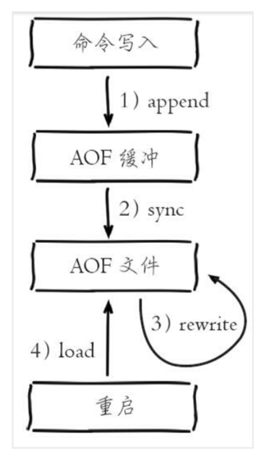

重启系统或者关闭系统，之前缓存在内存中的数据都会丢失再也不能找回。因此为了避免这种情况，Redis需要实现持久化将内存中的数据存储起来
<!--more-->

####  持久化

* RDB

将某个时间点的所有数据都存放到硬盘上

可以将快照复制到其他服务器从而创建具有相同数据的服务器副本

如果系统发生故障，将会丢失最后一次创建快照之后的数据。

如果数据量大，保存快照的时间会很长。

能够在指定的时间间隔能对你的数据进行快照存储。

* AOF

将写命令添加到 AOF 文件（append only file）末尾。

使用 AOF 持久化需要设置同步选项，从而确保**写命令**同步到磁盘文件上的时机。这是因为对文件进行写入并不会马上将内容同步到磁盘上，而是先存储到缓冲区，然后由操作系统决定什么时候同步到磁盘。

记录每次对服务器写的操作，当服务器重启的时候会重新执行这些命令来恢复原始的数据，AOF命令以redis协议追加保存每次写的操作到文件末尾。Redis还能对AOF文件进行后台重写，使得AOF文件的体积不至于过大。

同时开启RDB和AOF：你也可以同时开启两种持久化方式，在这种情况下当redis重启的时候会优先载入AOF文件来恢复原始的数据，因为在通常情况下AOF文件保存的数据集要比RDB文件保存的数据集要完整

#### RDB持久化
把当前内存数据生成快照保存到硬盘。
* 手动触发
  * 对应save命令，会阻塞当前Redis服务器，
* 自动触发
  * bgsave redis进程fork子进程，rdb持久化由子进程负责，完成后自动结束，阻塞只发生fork阶段，时间短

#### AOF
append only file，以独立日志的方式记录每次写命令，重启时再重新执行AOF中的命令，达到恢复数据的目的。

开启AOF需要配置appendonly yes,默认不开启。

AOF工作流程: 命令写入，文件同步，文件重写，重启加载

* AOF为什么把命令追加到aof_buf中？Redis使用单线程响应命令，如果每次写AOF文件命令都直接追加到硬盘，那么性能完全取决于当前硬盘负载。先写入缓冲区aof_buf中，还有另一个好处，Redis可以提供多种缓冲区同步硬盘的策略，在性能和安全性方面做出平衡。

* 随着AOF文件越来越大，需要定期对AOF文件进行重写，达到压缩的目的

数据恢复流程
*** AOF持久化开启且存在AOF文件时，优先加载AOF文件**
* AOF关闭或者AOF文件不存在时，加载RDB文件
* AOF/RDB文件存在错误时，Redis启动失败并打印错误信息

#### AOF和RDB优缺点
RDB优点
* 保存某个时间点的数据集，适合数据集备份
* 紧凑的单一文件，方便传送，适用于灾难恢复
* RDB保存时，父进程fork一个子进程来做，父进程不需要再做其他IO操作
* 相比AOF，恢复大数据集的时候，RDB快一点
缺点
* 若要保存整个数据集，通常要每隔5min或者更久做一次完成保存，万一redis宕机，**损失几分钟数据**
* RDB通过fork子进程保存数据集到硬盘上。数据集比较大的时候, fork 的过程是非常耗时的,可能会导致 Redis 在一些毫秒级内不能响应客户端的请求

AOF优点
* 不同fsync策略，无fsync，每秒fsync，每次写的时候fsync，默认每秒fsync,一旦故障，最多丢1s的数据
  * 无fsync，让os自动操作把缓存数据写到硬盘上，不可靠，但最快
* AOF是只进行追加的日志文件，不需要写入seek
* 整个重写操作是绝对安全的，因为 **Redis 在创建新 AOF 文件的过程中，会继续将命令追加到现有的 AOF 文件里面，即使重写过程中发生停机，现有的 AOF 文件也不会丢失**。而一旦新 AOF 文件创建完毕，Redis 就会从旧 AOF 文件切换到新 AOF 文件，并开始对新 AOF 文件进行追加操作
* AOF 文件有序地保存了对数据库执行的所有写入操作， 这些写入操作以 Redis 协议的格式保存， 因此 AOF 文件的内容非常容易被人读懂， 对文件进行分析（parse）也很轻松。导出（export） AOF 文件也非常简单：举个例子， 如果你不小心执行了 FLUSHALL 命令， 但只要 AOF 文件未被重写， 那么只要停止服务器， 移除 AOF 文件末尾的 FLUSHALL 命令， 并重启 Redis ， 就可以将数据集恢复到 FLUSHALL 执行之前的状态

AOF缺点
* 对于相同的数据集来说，AOF 文件的体积通常要大于 RDB 文件的体积
* 数据恢复（load）时AOF比RDB慢，通常RDB 可以提供更有保证的最大延迟时间。
* 大量写入和载入的时候，AOF的效率会比RDB低，大量写入，AOF会执行更多的保存命令，载入的时候也需要大量的重执行命令。

RDB优点：
* RDB 是紧凑的二进制文件，比较适合备份，全量复制等场景
* RDB 恢复数据远快于 AOF
RDB缺点：
* RDB 无法实现实时或者秒级持久化；
* 新老版本无法兼容 RDB 格式。
AOF优点：
* 可以更好地保护数据不丢失；
* append-only 模式写入性能比较高；
* 适合做灾难性的误删除紧急恢复。
AOF缺点：
* 对于同一份文件，AOF 文件要比 RDB 快照大；
* AOF 开启后，**会对写的 QPS 有所影响**，相对于 RDB 来说 写 QPS 要下降；
* 数据库恢复比较慢， 不合适做冷备。

#### 如何选择
* 不考虑硬盘大小，最安全的方式是RDB和AOF同时使用，即使AOF损坏无法修复，还可以用RDB恢复数据
* 若redis的数据在服务中并不是必要数据，只是当简单缓存，意味着数据的安全可靠性不是首要考虑范围，那么单独使用RDB就可以
* 不推荐单独用AOF

#### redis 持久化从rdb切到aof
* redis 默认是rdb把数据dump到dump.rdb文件下
* 贸然切换到aof，重启后会读取aof文件，但这个时候aof文件是空的
* 操作方法
  * redis command 动态配置打开aof方式，在shutdown安全退出后，自动记录当前所有记录到aof中，再修改redis文件配置打开aof方式，启动redis后会自动加载之前安全退出保存的aof数据