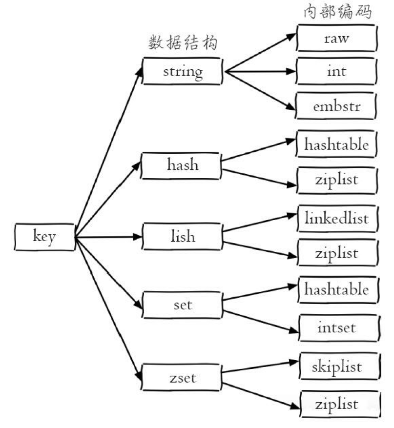

#### value的数据结构类型
Redis 可以存储键和五种不同类型的值之间的映射。键的类型只能为字符串，值支持五种数据类型：字符串、列表、集合、散列表、有序集合。
* string
  * 字符串类型的值实际可以是字符串（**简单的字符串、复杂的字符串**（例如JSON、XML））、**数字**
    **（整数、浮点数），甚至是二进制**（图片、音频、视频），但是值最大不能
    **超过512MB**。
  * set key_name value
* hash
  * hset key_name field value
* list
  * linkedlist
  * ziplist 
  * lpush key_name v1 v2 ... vn list头部添加字符串元素
  * rpush key_name v1 v2 ... vn
  * lrem key_name count value 对应list中删除count个和value相同的元素
  * llen key_name 返回对应的list长度
* set
  * sadd key_name value
  * 集合通过哈希表实现，添加删除查找的复杂度都是O(1)
* zset(有序集合)
  * zadd key_name score1 value1
  * 通过分数从小到大排序，分数可以重复，元素不重复
  
<!--more-->



#### redis 原理
单线程处理命令，利用I/O多路复用技术来解决I/O问题
单线程但快的原因。 每秒万级别的处理能力
* 纯内存访问
* 非阻塞I / O 
* 单线程避免线程切换和竞争状态产生的消耗
* 支持数据持久化
* 不仅仅支持key-value 类型数据，还提供list，set，zset(有序集合)，hash等数据结构的存储

#### string 类型

一个key对应一个value，string是二进制安全，类似于Java中的map

```bash
127.0.0.1:6379> set hello world
OK
127.0.0.1:6379> get hello
"world"
```
set/get/del/incr/decr/incrby/decrby  
应用  
信息缓存，计数器，分布式锁
* 记录每个用户或者每个商品访问次数
  * 键名 userid:pageview / pageview:userid 
  * 增加次数用incr
  * 用户访问以及商品浏览修改频繁，使用mysql频繁修改会造成mysql压力，redis内存快，且单线程无竞争
* 缓存频繁读取，但不常修改，用户信息，视频信息
  * 先从redis读，没有的话从mysql读，并写到redis中缓存，设置过期时间
  * 直接将用户一条mysql记录做序列化(通常序列化为json)作为值，userInfo:userid 作为key，键名:userInfo:123，value存储对应用户信息的json串。如 key为："user:id:name:1",  value为"{"name":"leijia","age":18}"
* 限定某个ip特定时间内的访问次数
  * 用key记录IP，value记录访问次数，同时key的过期时间设置为60秒，如果key过期了则重新设置，否则进行判断，当一分钟内访问超过100次，则禁止访问
* 分布式session
  * 如果想要多个服务器共享一个session，可以将session存放在redis中，redis可以独立于所有负载均衡服务器，也可以放在其中一台负载均衡服务器上；但是所有应用所在的服务器连接的都是同一个redis服务器

#### hash类型

redis hash 是一个键值对(key-value) 集合, string类型的key和value的映射表，适合存储对象

理解： hash 看成一个key-value 的集合

```bash
// hash-key 可以看成是一个键值对集合的名字,在这里分别为其添加了 sub-key1 : value1、
sub-key2 : value2、sub-key3 : value3 这三个键值对
127.0.0.1:6379> hset hash-key sub-key1 value1
(integer) 1
127.0.0.1:6379> hset hash-key sub-key2 value2
(integer) 1
127.0.0.1:6379> hset hash-key sub-key3 value3
(integer) 1
// 获取 hash-key 这个 hash 里面的所有键值对
127.0.0.1:6379> hgetall hash-key
1) "sub-key1"
2) "value1"
3) "sub-key2"
4) "value2"
5) "sub-key3"
6) "value3"
// 删除 hash-key 这个 hash 里面的 sub-key2 键值对
127.0.0.1:6379> hdel hash-key sub-key2
(integer) 1
127.0.0.1:6379> hget hash-key sub-key2
(nil)
127.0.0.1:6379> hget hash-key sub-key1
"value1"
127.0.0.1:6379> hgetall hash-key
1) "sub-key1"
2) "value1"
3) "sub-key3"
4) "value3"
```

Hash 和 Java的HashMap类似，都是数组加链表，当发生hash碰撞时，会将元素追加到链表上。


Hash可以对用户信息的每个字段单独存储；

```bash
hset books java "Effective java" (integer) 1
hset books golang "concurrency in go" (integer) 1
hget books java "Effective java"
```

场景：

购物车：`hset [key] [field] [value]` 命令， 可以实现以`用户Id`，`商品Id`为`field`，商品数量为`value`，恰好构成了购物车的3个要素。

将商品id和商品数量序列化成json字符串，那么也可以用上面讲的string类型存储.

**当对象的某个属性需要频繁修改**时，不适合用string+json，因为它不够灵活，每**次修改都需要重新将整个对象序列化并赋值**；如果使用hash类型，则可以针对某个属性单独修改，没有序列化，也不需要修改整个对象。比如，商品的价格、销量、关注数、评价数等可能经常发生变化的属性，就适合存储在hash类型里


#### list 类型 

简单的**字符串**列表，list元素允许**重复**，按照插入顺序排序，可以往两边添加元素

```bash
127.0.0.1:6379> rpush list-key v1
(integer) 1
127.0.0.1:6379> rpush list-key v2
(integer) 2
127.0.0.1:6379> rpush list-key v1
(integer) 3
127.0.0.1:6379> lrange list-key 0 -1
1) "v1"
2) "v2"
3) "v1"
127.0.0.1:6379> lindex list-key 1
"v2"
127.0.0.1:6379> lpop list
(nil)
127.0.0.1:6379> lpop list-key
"v1"
127.0.0.1:6379> lrange list-key 0 -1
1) "v2"
2) "v1"
```

redis中list底层不是 一个双向链表

数据量少的时候，底层存储为一块连续内存 (ziplist 压缩链表)，所有元素紧挨着一起存储

数据量多的时候，变成quicklist结构 (ziplist + 链表)

场景

* 消息队列: lpop , rpush 实现队列
* 朋友圈点赞列表，评论列表，排行榜： lpush, lrange 实现最新列表
* 定时排行榜
  * lrange命令可以分页查看队列中的数据
  * 将每隔一段时间计算一次的排行榜存储在list类型
  * 访问接口时通过page和size分页转化成lrange命令获取排行榜数据


#### set类型

redis的set是字符串类型的**无序**集合，集合通过哈希表实现，

增删查 复杂度都是O(1)

一个key对应多个字符串类型的value，也是一个字符串类型的集合，只是元素**不能重复**

```bash
127.0.0.1:6379> sadd k1 v1
(integer) 1
127.0.0.1:6379> sadd k1 v2
(integer) 1
127.0.0.1:6379> sadd k1 v3
(integer) 1
127.0.0.1:6379> sadd k1 v1
(integer) 0
127.0.0.1:6379> smembers k1
1) "v3"
2) "v2"
3) "v1"
127.0.0.1:6379>
127.0.0.1:6379> sismember k1 k4
(integer) 0
127.0.0.1:6379> sismember k1 v1
(integer) 1
127.0.0.1:6379> srem k1 v2
(integer) 1
127.0.0.1:6379> srem k1 v2
(integer) 0
127.0.0.1:6379> smembers k1
1) "v3"
2) "v1"
```

set和HashSet类似， 内部的键值对是无序的，唯一的，内部实现相当于一个特殊的字典，所有的value都是一个值NULL


应用场景

* 好友，关注，粉丝，
  * sinter 获取A和B两个用户的共同好友
  * sismember 判断A是否是B的好友
  * scard 获取好友数量
* 存储某活动中中奖的用户ID，有去重功能，保证一个用户不会中奖两次
* 收藏夹
  * QQ音乐中如果你喜欢一首歌，点个『喜欢』就会将歌曲放到个人收藏夹中，每个收藏的集合存放用户收藏过的歌曲id


zset

zset每个元素都会关联一个double类型 的分数，redis通过分数为集合中的成员从小到大排序，

zset元素是唯一的，但是分数可以重复。


```bash
127.0.0.1:6379> zadd zset-key 728 member1
(integer) 1
127.0.0.1:6379> zadd zset-key 982 member0
(integer) 1
127.0.0.1:6379> zadd zset-key 982 member0   # 元素是唯一的，
(integer) 0
127.0.0.1:6379> zrange zset-key 0 -1 withscores  # 输出顺序按照分数从小到大
1) "member1"
2) "728"
3) "member0"
4) "982"
127.0.0.1:6379> zrangebyscore zset-key 0 800 withscores
1) "member1"
2) "728"
127.0.0.1:6379> zrem zset-key member1
(integer) 1
127.0.0.1:6379> zrem zset-key member1
(integer) 0
127.0.0.1:6379> zrange zset-key 0 -1 withscores
1) "member0"
2) "982"
```

场景：

* 做排行榜， 与list不同，zset可以**实现动态的排序**，例如存储粉丝列表，value是粉丝的用户ID，score是关注时间， 对列表按照关注时间排序
* 存储学生成绩，value是学生ID，score是成绩
* 实时排行榜，用redis key存储榜单类型，score为点击量，value为歌曲id，用户每点击一首歌曲会更新redis数据，sorted set会依据score即点击量将歌曲id排序。


[参考1](https://aijishu.com/a/1060000000091735)

[参考2](http://kmanong.top/kmn/qxw/form/article?id=18432&cate=93)


