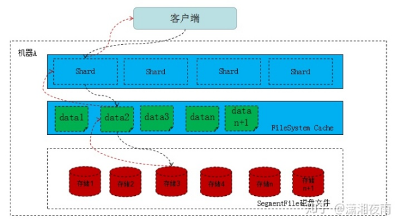

ES 在数据量很大的情况下（数十亿级别）如何提高查询效率？
<!--more-->
#### **Filesystem Cache**

往 ES 里写的数据，实际上都写到**磁盘文件**里

查询的时候，操作系统会将**磁盘文件里的数据自动缓存到 Filesystem Cache** 里面去。

es 的搜索引擎严重依赖于**底层的 filesystem cache**，你如果给 filesystem cache 更多的内存，尽量让内存可以容纳所有的 idx segment file 索引数据文件，那么你搜索的时候就基本都是走内存的

这里有个真实的案例。某个公司 es 节点有 3 台机器，每台机器看起来内存很多，64G，总内存就是 64 * 3 = 192G。每台机器给 es jvm heap 是 32G，那么剩下来留给 filesystem cache 的就是每台机器才 32G，总共集群里给 filesystem cache 的就是 32 * 3 = 96G 内存。而此时，整个磁盘上索引数据文件，在 3 台机器上一共占用了 1T 的磁盘容量，es 数据量是 1T，那么每台机器的数据量是 300G。这样性能好吗？ filesystem cache 的内存才 100G，十分之一的数据可以放内存，其他的都在磁盘，然后你执行搜索操作，大部分操作都是走磁盘，性能肯定差。

最佳的情况下，就是你的机器的内存，至少可以容纳你的总数据量的一半。

#### **仅仅写入 es 中要用来检索的少数几个字段就可以了**  ES + hbase

比如说你现在有一行数据。id,name,age .... 30 个字段。但是你现在搜索，只需要根据 id,name,age 三个字段来搜索。如果你傻乎乎往 es 里写入一行数据所有的字段，就会导致说 90% 的数据是不用来搜索的，结果硬是占据了 es 机器上的 filesystem cache 的空间，单条数据的数据量越大，就会导致 filesystem cahce 能缓存的数据就越少。其实**，仅仅写入 es 中要用来检索的少数几个字段就可以了**，比如说就写入 es id,name,age 三个字段，然后你可以把其他的字段数据存在 mysql/hbase 里，我们一般是建议用 **es + hbase** 这么一个架构。

hbase 的特点是适用于海量数据的在线存储，就是对 hbase 可以写入海量数据，但是不要做复杂的搜索，做很简单的一些根据 id 或者范围进行查询的这么一个操作就可以了。从 es 中根据 name 和 age 去搜索，拿到的结果可能就 20 个 doc id，然后根据 doc id 到 hbase 里去查询每个 doc id 对应的完整的数据，给查出来，再返回给前端。

####  数据预热

把一些大V，平时看的人很多的数据，你自己提前后台搞个系统，每隔一会儿，自己的后台系统去搜索一下热数据，刷到 filesystem cache 里去，后面用户实际上来看这个热数据的时候，他们就是直接从内存里搜索了，很快

#### **冷热分离**

将大量的访问很少、频率很低的数据，单独写一个索引，然后将访问很频繁的热数据单独写一个索引。最好是将冷数据写入一个索引中，然后热数据写入另外一个索引中，这样可以确保热数据在被预热之后，尽量都让他们留在 filesystem os cache 里，别让冷数据给冲刷掉

#### **分页性能优化**

* **不允许深度分页（默认深度分页性能很差）**
* **类似于 app 里的推荐商品不断下拉出来一页一页的**
  * scroll 会一次性给你生成所有数据的一个快照，然后每次滑动向后翻页就是通过游标 scroll_id 移动，获取下一页下一页这样子，性能会比上面说的那种分页性能要高很多很多，基本上都是毫秒级的。
  * 不能随意跳到任何一页的场景

####  

