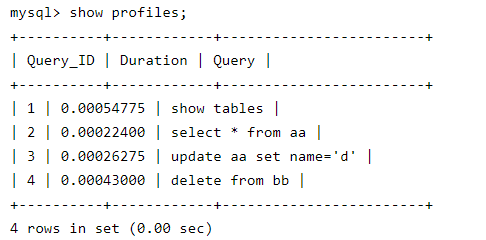

参考深入浅出MySQL 第18章
### 各种SQL执行效率
> show status
* show [session | global] status
  * session 当前连接
  * global 从数据库上次启动至今统计结果
* show status like 'Com_%';
  * Com_select：执行select 操作的次数，一次查询只累加1。
  * Com_insert：执行INSERT 操作的次数，对于批量插入的INSERT 操作，只累加一次。
  * Com_update：执行UPDATE 操作的次数。
  * Com_delete：执行DELETE 操作的次数。
<!--more-->
上面这些参数对于所有存储引擎的表操作都会进行累计。下面这几个参数只是针对InnoDB 存储引擎的.

通过以上几个参数，可以很容易地了解当前数据库的应用是以插入更新为主还是以查询操作为主，以及各种类型的SQL 大致的执行比例是多少。对于更新操作的计数，是对执行次数的计数，不论提交还是回滚都会进行累加。


### mysql 慢查询

* 慢查询: 在**日志中记录运行比较慢**的sql语句

* 数据库中开启慢查询
  * 1.修改配置，在mysql.ini 中设置慢查询的定义时间(超过两秒即慢查询)，以及慢查询log日志记录
  * 2.通过mysql数据库开启慢查询


* explain select * from table order by col1 limit 0,1000
  * 返回一个结果分析
  * type: 显示连接用了什么数据类型
    * const: 一般是 where col = 某常数
    * eq_ref:  主键扫描或者索引唯一扫描
    * ref:  索引的前缀扫描
    * range: between .. and.. ， > ，<
  * rows: 需要扫描的行数
  * possible_keys:可能用到的索引
  * Key:  使用的索引

### 慢查询优化

* 索引没起作用
  * like 语句，匹配字符串的第一个字符串为“%”，索引不会起作用，“%” 不在第一个位置索引才会起作用
  * 多列索引
    * mysql 可以为多个字段创建索引，一个索引最多可以包括16个字段，对于多列索引，只有查询条件使用这些字段中的第一个字段时，索引才会被使用
* 优化db结构
  * 字段很多的表分成多个表
  * 增加中间表

* 分页查询的优化

  * 分页一般通过limit 加 偏移量，同时加上order by。若有对应的索引，效率一般不错

    * 先查询出主键的id值

      ```
      select * from product limit 866613, 20 
      拆解成
      SELECT * FROM product WHERE ID > =(select id from product limit 866613, 1) limit 20
      因为id是主键，select id from product limit 866613, 20 0.2秒
      
      join也可以
      SELECT * FROM product a JOIN (select id from product limit 866613, 20) b ON a.ID = b.id
      ```
    * 筛选字段加上索引
    * 复合索引 ( 建立复合索引 where 中的条件 + limit中用到的主键)
  
##### 如何检测sql的运行时间
show profiles

