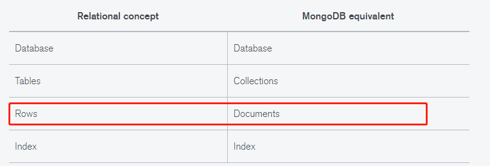
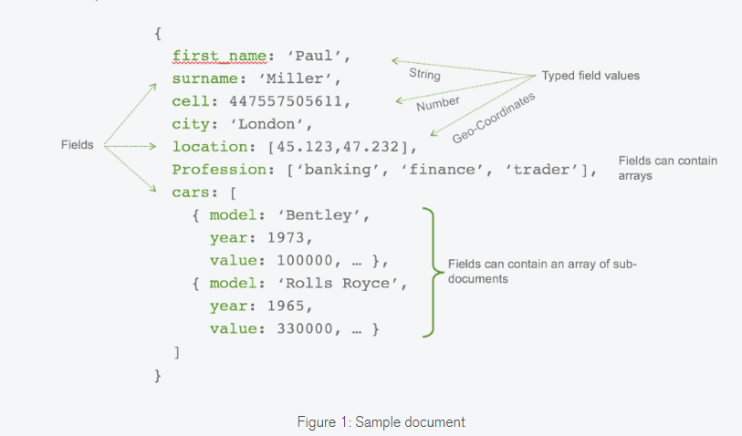

[TOC]

### 使用

#### 1. 安装mongodb

```bash
sudo apt update
sudo apt install -y mongodb
# 安装完后mongodb自动启动
```

#### 2. 检查状态

```bash
# 检查服务状态
sudo systemctl status mongodb
# 停止服务
sudo systemctl stop mongodb
# 重启服务
sudo systemctl restart mongodb
```

#### 3. 配置config

```bash
# mongodb 支持远程连接配置
sudo vim /etc/mongodb.conf
# 把bind_ip=127.0.0.1 改成 0.0.0.0
sudo systemctl restart mongodb
```

#### 4. 权限管理

[参考link](https://segmentfault.com/a/1190000015603831)

#### 5. 数据迁移

离线迁移-先备份后还原

```bash
# 备份
mongodump -h IP_host --port 端口 -u 用户名 -p 密码 -d 数据库 -o 文件存在路径
# 样例-备份ENERGY到当前目录下的backup folder中
mongodb -d ENERGY -o ./backup

# 还原
mongorestore 文件路径
# 样例 --drop 先删除所有的记录
mongorestore --drop ./backup
```

#### 6. 指定版本mongodb安装

[参考1](https://www.cnblogs.com/oucbl/p/8417635.html)

```
# 重装mongodb
sudo apt purge mongodb-org*
sudo rm -r /var/log/mongodb
sudo rm -r /var/lib/mongodb
sudo apt-key adv --keyserver hkp://keyserver.ubuntu.com:80 --recv EA312927
echo "deb http://repo.mongodb.org/apt/ubuntu xenial/mongodb-org/3.2 multiverse" | sudo tee /etc/apt/sources.list.d/mongodb-org-3.2.list
sudo apt update
sudo apt-get install -y mongodb-org
```


### 概念



一个document就是一条json记录？？



mongodb中的database不用像关系型数据库一样，需要先事先创建(create database)，在执行insert数据命令后，如果database 不存在，会自动创建

