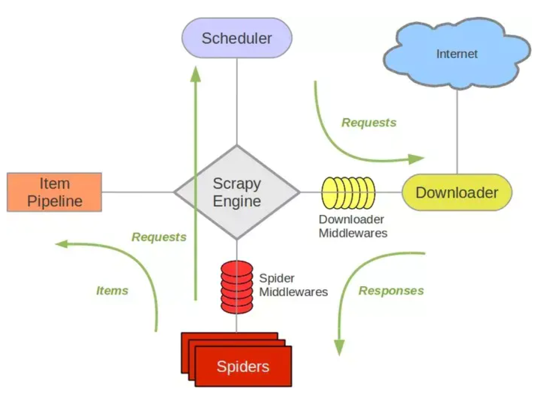

[TOC]

#### Spider 类

- 定义爬取网站的动作
- 分析爬取下来的网页

* 以初始的URL初始化Request，并设置回调函数。当该Request成功请求并返回时，Response生成并作为参数传给该回调函数

* 在回调函数内分析返回的网页内容。返回结果有两种形式。

  * 一种**是解析到的有效结果返回字典或Item对象**，它们可以经过处理后（或直接）保存。
    * 通过Feed Exports等组件将返回结果存入到文件。如果设置了Pipeline的话，我们可以使用Pipeline处理（如过滤、修正等）并保存。
  * 另一种是解析得到下一个（如下一页）链接，可以利用此链接构造Request并设置新的回调函数，返回Request等待后续调度。
    * request执行成功得到Response之后，Response会被传递给Request中定义的回调函数，在回调函数中我们可以再次使用选择器来分析新得到的网页内容，并根据分析的数据生成Item。

  

Spider把requests发给调度器scheduler

scheduler把request转给downloader下载

downloader下载得到的response转给spider

Spider把从response中解析得到的item转给item pipeline

item pipeline 对item处理后负责入库