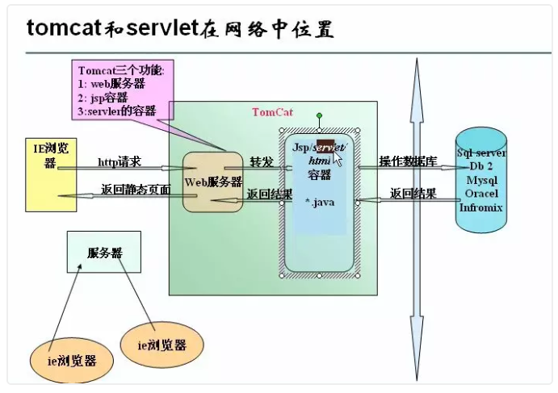

[TOC]


#### Tomcat




#### 安装

[windows 安装参考1](https://blog.csdn.net/haishu_zheng/article/details/50768272)

[win 安装参考2](https://blog.csdn.net/u011982967/article/details/80999552)


#### 启动

```
catalina run
```

遇到win平台下 日志乱码的情况

> 解决办法 1.打开你安装Tomcat的所在目录，本文以7.0.92为例。 2. 打开后选择conf目录。 . 3. 将里面的logging.properties文件用编辑器打开，本例子是使用“Notepad++”编辑器打开。 4. 打开后大约在50行左右找到java.util.logging.ConsoleHandler.encoding = UTF-8 5. 修改为java.util.logging.ConsoleHandler.encoding = GBK； 6.重新启动Tomcat就可以了。