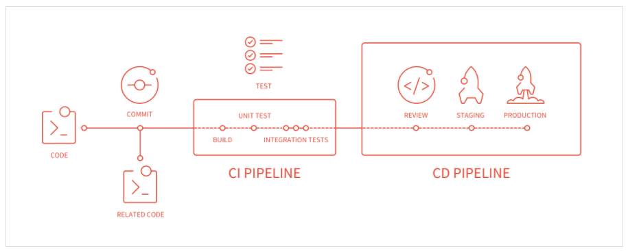
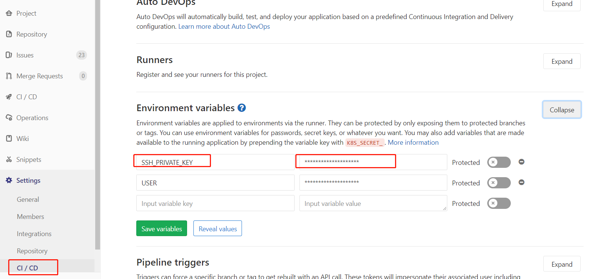

### Gitlab-CI





#### pipeline

pipeline 实际是一组 stages 中执行 job 的集合，代表着使用者触发的一次构建。里面可以包含多个流程，如安装依赖、运行测试、编译、部署测试服务器、部署生产服务器等流程。 **任何提交或者 Merge Request** 的合并都可以触发 Pipeline

#### stage

pipeline 中的 jobs 按照构建阶段进行分类，这些分类就是一个个 stage. 一个 pipeline 中可以定义多个 stage 

```yaml
stages:
  - build
  - test
  - staging
  - production
```

stage 的触发顺序和 `stages` **字段值定义的顺序一致**，并且只有完成当前 stage ， pipeline 才会触发下一个 stage ，如果 stage 失败了，则下一个 stage 将不会被触发，完成所有的 stage 表示此次 pipeline 构建成功。

#### job

job 表示 stage 中实际执行的任务。

一个 stage 中可以有多个 job，比如 Test stage 的 `test1`、`test2` job.

```ymal
test1:
  stage: Test
  script: 
    - xxxx
  only:
    - xxxx
  tags:
    - xxxx
    
test2:
  stage: Test
  script: 
    - xxxx
  only:
    - xxxx
  tags:
    - xxxx
```

在有足够 runner （job 执行宿主机） 的情况下，同个 stage 中的 job 是并行的，当 stage 中的所有 job 都执行成功后，该 stage 才算完成，否则视为失败。


### Gitlab-Runner

GitLab Runner 内部会起一个无限循环，根据 `check_interval` 字段设置的时间间隔，去 GitLab 请求需要执行的任务  [How shared Runners pick jobs ](https://docs.gitlab.com/ce/ci/runners/#how-shared-runners-pick-jobs)，[How check_interval works](https://gitlab.com/gitlab-org/gitlab-runner/blob/master/docs/configuration/advanced-configuration.md#how-check_interval-works)


#### 安装Runner

以镜像方式安装 runner

```bash
docker pull gitlab/gitlab-runner:latest
```

```
docker stop gitlab-runner
docker rm gitlab-runner
docker run -d --name gitlab-runner \
    --net host \
    --restart always \
    -v /gitlab/gitlab-runner:/etc/gitlab-runner \
    -v /var/run/docker.sock:/var/run/docker.sock \
    -v /etc/hosts:/etc/hosts \
    -v /root/project:/root/project \
    gitlab/gitlab-runner:latest


```


#### 注册Runner

进去gitlab-runner docker container中

```
gitlab-runner register
```


#### 启动/关闭 Runner


#### 配置Runner


#### Others

* 确保每次Merge Request都要通过Pipeline


### CD 持续交付/部署

远程服务器的自动部署, 由于server和runner可能不是一台机子，使用ssh来实现远端的部署

实现在`gitlab.com`的docker环境，ssh到我们的生产服务器，并执行相关的部署语句

```
ssh-keygen -t rsa
```

把生成的公钥添加到authorized-key中

```
cat ~/.ssh/id_rsa.pub >> ~/.ssh/authorized_keys
```

* 先在部署的服务器上生成ssh，然后把id_rsa中的内容复制到 SSH_PRIVATE_KEY 对应的value中



[参考](http://zacksleo.top/2017/04/14/GitLabCI%E9%80%9A%E8%BF%87ssh%E8%BF%9B%E8%A1%8C%E8%87%AA%E5%8A%A8%E9%83%A8%E7%BD%B2/index.html)


[rsync 命令参考](http://einverne.github.io/post/2017/07/rsync-introduction.html)


* 前端分支 

  * 自动测试 (与前端沟通，前端如何测试)
  * run  build 生成的dist 更新到最新的后端中
    * 200  /home/xyu3/autocv_test_sample/web/AutoCV
  * 生成的dist更新到autocv_deploy以便打镜像时用到最新的前端
    * 200  /home/xyu3/autocv_deploy/web/AutoCV  
    * issue - * 分支

  * new feature / bug fix 新建分支时以 issue - issue hash id 的形式创建
  * 开发人员编写单元测试(属于feature开发时)

* develop分支

  * 被发起merge request,触发自动测试

* release分支

  * 命名格式 release - *
  * 自动测试 
  * 自动部署测试server 
    * 200  /home/xyu3/autocv_test_sample/
    * 在200起一个autocv服务，保证上面是开发中版本最新的
    * 访问端口是8082； redis: 6380, mysql 3307

* master分支

  * 自动测试

  * 打tag触发,发布镜像在200 server上，名称为autocv:cd_deploy。 每次触发镜像生成后，最好重命名本次的镜像，以免下次tag触发生成的镜像覆盖。

    ```bash
    docker tag imageID repository:tag
    ```

  * 打镜像耗时过长，需要重新在gitlab上设置CI/CD的超时限制


```
docker run  -p 3307:3306 --env MYSQL_DATABASE=autocv_ci --env MYSQL_USER=autocv_user_ci --env MYSQL_PASSWORD=autocv_user_password_ci --env MYSQL_ROOT_PASSWORD=autocv_db_root_password_ci --name autocv_db_ci -v /home/xyu3/autocv_test_sample/mysql:/var/lib/mysql -d mysql:5.7 --character-set-server=utf8 --collation-server=utf8_general_ci
```

```
docker run -p 6380:6379 --name autocv_redis_ci -d redis:4.0.5-alpine
```


镜像发布


* 复制autocv源码一份，命名成autocv_source

* 起docker_cython.sh  起一个镜像做cython代码混淆

* 进入镜像后，python cython_setup.py build_ext --inplace

* run完以后会生成一些.so文件，然后run cython_clean_source.py 脚本删一些py和c文件，另外 rm build -r 文件夹

* 先用generate_migrate.py 生成 target_migration 文件夹，然后拷贝到刚刚的autocv_cython 文件夹中

* 上述autocv_cython文件夹代码 挂载到镜像中

* 修改DockerFile中对应的记录


### autocv 配置详情

10.127.3.197 作为 local registry 存储测试镜像

10.127.3.199 起 runner 

10.127.3.200 作为测试服务部署 暴露端口8082为服务端口

/autocv_test_sample/

10.127.3.109 是测试runner


10.127.3.200 上主要有两个服务

* autocv_deploy
  * 里面的文件主要用于发布镜像
* autocv_test_sample
  * 主要用于起测试服务


