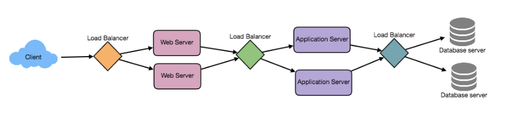

[TOC]

### 负载均衡

#### LB 放置位置

* between user and web server
* between web servers and  an internal platform layer like application server or cache servers
* between internal platform servers and database

#### 常见负载均衡方案

* 基于DNS负载均衡
  * 可实现地域上的流量均衡
* 基于硬件负载均衡：F5
  * 主要用于大型服务器集群中的负载需求
* 基于软件负载均衡: Nginx, Squid
  * 大多基于机器层面的流量均衡

##### 基于DNS

* 在DNS服务器做一个配置，用户访问域名时， 根据用户所在位置返回对应的不同ip
* 缺点: 配置修改后，生效不及时,由于 DNS的特性导致的，DNS一般也有多级缓存

##### 基于硬件

F5 Network Big-IP 是一个网络设备，类似网络交换机，通过硬件抗压.  贵

##### 基于软件

软件负载均衡分为 七层协议 和 四层协议

* 四层负载均衡
  * 网络协议共七层，基于第四层传输层来做流量分发的方案 例如LVS
  * 负载均衡性更高一点，一般 几十万/秒的处理量
* 七层负载均衡
  * 基于第七层应用层来做流量分发 ， 如Nginx
  * 一般 几万/秒

#### 均衡算法

一般分为静态和动态

##### 静态均衡

* 轮询
  * 将request按顺序轮流分到每个节点
  * 集群性能瓶颈受性能差的服务器影响
* 随机法
  * 随机分配到各个节点， 当client调用server端次数增多，实际效果接近于平均分配
* 加权轮询 /随机
  * 权重就是后端节点的配置
* IP Hash
  * 根据请求中的某个信息做hash，对用户IP或者ID
  * 可以保证同一个用户或者IP源永远被送到同一台服务器，一般用于处理缓存或者会话等功能

##### 动态均衡

* 最小连接数
  * 转发流量前，先评估每台服务器的负载压力情况
  * 弊端：要动态评估后端服务器的负载压力 ,导致LB除了做转发流量，还要采集连接数，请求数，CPU负载指标等等
  * 优点: 动态分配更科学，而且适用于当有很多persistent  client connections的时候
* 最快响应速度
  * 根据请求的响应时间，来动态调整每个节点的权重，将响应速度快的服务节点分配更多的请求

#### 参考

[**快速理解高性能HTTP服务端的负载均衡技术原理**](http://www.52im.net/thread-1950-1-1.html)

[一篇读懂分布式架构下的负载均衡技术：分类、原理、算法、常见方案等](https://zhuanlan.zhihu.com/p/64207926)

