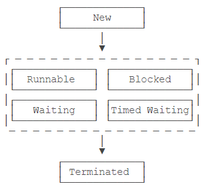

[TOC]


#### 线程的状态

* 一个线程对象只能调用一次start() 方法启用新线程,并在新线程中执行run( )。 run( ) 方法执行完后，线程就结束了
* 

* 上图是线程可能的状态
  * runnable:运行中的线程,正执行 run( ) 方法的 java code
  * blocked : 运行中的线程功能, 因为某些操作被阻塞而挂起
  * timed waiting:  运行中的线程, 因为执行 sleep() 方法正计时等待

* 线程终止的原因
  * 正常: run() 正常执行到return 
  * 意外终止: run() 因为未捕获的异常导致线程终止
  * 对某个线程的Thread实例调用stop() 强制终止

#### 中断线程

* 中断线程就是其他线程给该线程发一个信号，该线程收到信号后结束执行`run()`方法，使得自身线程能立刻结束运行。
* 只需要在其他线程中对目标线程调用`interrupt()`方法，目标线程需要反复检测自身状态是否是interrupted状态，如果是，就立刻结束运行。
* 或者通过设置 running 标志位


#### 同步方法

```java
public class Counter {
    private int count = 0;

    public void add(int n) {
        synchronized(this) {
            count += n;
        }
    }

    public void dec(int n) {
        synchronized(this) {
            count -= n;
        }
    }

    public int get() {
        return count;
    }
}
```

synchronized锁住对象是this , 即当前实例，使得创建多个Counter实例的时候，之间互不影响，可以并发执行

* 如果一个类被设计为允许多线程正确访问，那么这个类就是 “**线程安全**”
* 还有一些不变类如 String，Integer，LocalDate 所有成员变量都是final，多线程同时访问时，只能读不能写，因此也是 “线程安全”

```java
public void add(int n) {
    synchronized(this) { // 锁住this
        count += n;
    } // 解锁
}
```

等价于

```java
public synchronized void add(int n) { // 锁住this
    count += n;
} // 解锁
```

synchronized 修饰的方法就是同步方法，表示整个方法都必须用this实例加锁

给静态方法添加 synchronized 

对于`static`方法，是没有`this`实例的，因为`static`方法**是针对类而不是实例**。但是我们注意到任何一个类都有一个由**JVM自动创建的`Class`实例**，因此，对`static`方法添加`synchronized`，锁住的是该类的`Class`实例


#### 死锁

* 可重入的锁
  * 同一个线程重复获取同一个锁，能被同一个线程重复获取的锁
  * java的线程锁是可重入锁
* 死锁
  * 一个线程可以获取一个锁后，再继续获取另一个锁
  * 获取多个锁时，不同线程获取多个不同对象的锁可能导致死锁
  * 避免死锁- 线程获取锁的顺序要一致


#### ReadWriteLock
* 潜在问题
  * 如果有线程正在读，写线程需要等待读线程释放锁后才能获取写锁，读的过程不允许写， 一种悲观的读锁
* Java8 新的读写锁 StampedLock
  * 读的过程也允许获取写锁后写入
  * 读的数据可能不一致，需要额外代码判断读的过程中是否有写入， 乐观锁
* 乐观锁
  * 乐观地估计读的过程中大概率不会有写入
  * 并发效率更高，即便小概率的写入导致读取的数据不一致，需要能检测出来再读一遍
* 悲观锁
  * 读的过程中拒绝写入


#### Atomic 原子性

* 原子操作的封装类
  * java.util.concurrent.atomic
* Atomic类
  * 通过无锁 lock-free的方式实现线程安全访问
  * 利用了 CAS Compare and Set


#### hashCode 和equals 区别

* Java的 equals方法和hashCode方法这样规定
  * 相同的对象必须有相等的hashcode
  * 如果两个对象的hashCode相同，它们不一定相同，即equals() 不一定为true


#### Java 接口

* 由于Java不支持多继承，但可能某个类或对象要使用分别在几个类或对象里面的方法或属性
* 接口
  * 没有任何实现代码
  * 一个类实现接口，要实现接口里所有的方法和属性，接口里的属性默认下都是public static，所有方法默认下是public
  * 一个类可以实现多个接口


#### abstract class和interface 区别

* 抽象类
  * 声明方法，而不实现的类
* 接口
  * 所有方法都是抽象的
  * 只可以定义static final 成员变量