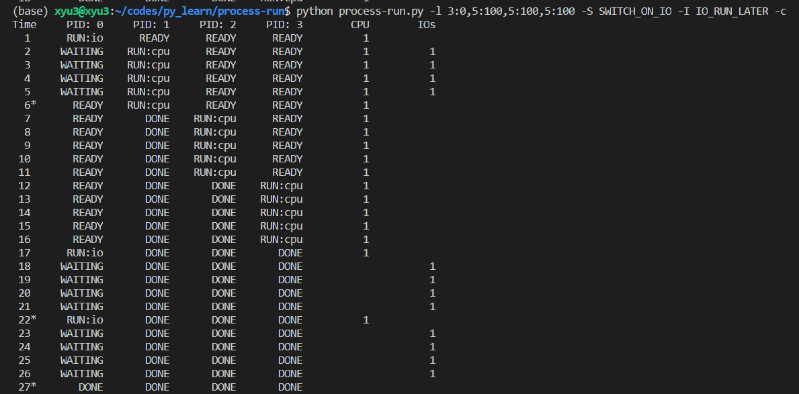
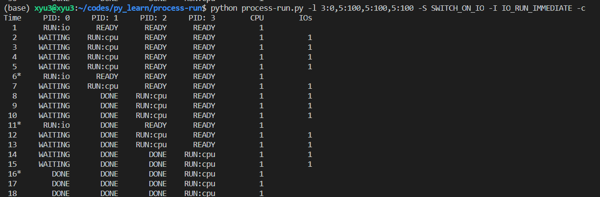

#### 第二章

操作系统，取得CPU，内存或磁盘等物理资源，并对他们进行虚拟化。它处理与并发相关的问题，且持久地存储文件。

系统调用(process call)与过程调用(procedure call) 区别

* 系统调用将控制转移(跳转)到OS中，同时提高硬件特权级别

  * 特权提升到内核模式，内核模式下，os可以完全访问系统的硬件

* 用户应用程序以用户模式(user mode) 运行, 意味着硬件限制了应用程序的功能

  * 用户模式运行的应用程序通常不能发起对磁盘的I/O请求，不能访问任何物理内存页或在网络上发送数据包

  

#### 第四章

以下是机制 mechanism

时分共享

* 允许资源由一个实体使用一小段时间，然后由另一个实例使用
* 如CPU，网络链接

空分共享

* 资源在空间上被划分给希望使用它的人，
* 如磁盘空间，一般将块划分给文件，在用户删除文件之前，不可能把它分配给其他文件

在机制之上,OS有一些**智能策略 policy**** , OS作出某种决定的算法

##### 调度策略 scheduling policy 

* 历史信息如哪个程序在最后一分钟运行得更多
* 工作负载知识，如运行什么类型的程序

##### 进程

* 进程可以访问的内存(地址空间) 是该进程的一部分
  * 内存里有指令，程序读取和写入的数据
* 寄存器
  * PC 程序计数器 -- 程序当前执行哪个指令
  * 栈指针和相关的帧指针
    * 管理函数参数栈，局部变量和返回地址

##### 进程API

* 创建create
* 销毁destroy
* 等待wait
* 其他控制 miscellaneous control
  * 如暂停进程，然后恢复
* 状态 status

##### 进程创建细节

os运行程序 

* 第一件事把code和所有静态数据加载到内存，加载到进程的地址空间
  * 最初code以某种可执行格式驻留在磁盘上，需要OS从磁盘读取这些字节，并把他们放在内存中的某处
  * 早期的OS 加载过程会在运行程序之前全部完成，现代OS 惰性执行该过程，即**仅在程序执行期间需要加载的代码或数据片段，才会加载**。

* UNIX系统下，默认每个进程有三个打开的FD
  * 标准输入，输出，错误

* 为所有就绪的进程保留某种**进程列表**，以及跟踪当前运行的进程的一些附加信息
* 以某种方式跟踪被阻塞的进程
* 当I/O事件完成时，OS应确保唤醒正确的进程，让它准备好再次运行

* 对于停止的进程，**寄存器上下文将保存其寄存器的内**容。当一个进程停止时，其寄存器将被保存到这个内存位置。通过恢复这些寄存器(将它们的值放回实际的物理寄存器)，OS可恢复运行该进程。称为**上下文切换**

作业 process-run.py

进程有四个状态

running ， ready ， waiting(或者是blocked)， done

-S 控制进程之间切换的机制

* SWITCH_ON_IO
  * system will switch when a process issues an IO
* SWITCH_ON_END
  * system will only switch when the current process is done

-I 控制IO结束时的behavior

* IO_RUN_LATER

  * switch to this process when it is natural to  (e.g., depending on process-switching behavior)

  

* IO_RUN_IMMEDIATE
  * switch to this process right now

  * 这个模式下，上一个IO结束，马上先切换到新的IO

    

  * 这个模式下CPU的有效利用率会高很多

#### 第五章

UNIX系统中的进程创建。

通过一对系统调用 fork()和exec(). 进程还可以通过 wait(), 来等待其创建的子进程执行完成。

* fork()
  * 子进程不会从main()函数开始执行，而是直接从fork()系统调用返回
  * 子进程并不是完全拷贝了父进程，虽然它有自己的地址空间, 寄存器, PC, 但fork()返回的值不同
    * 父进程获得返回值是 新建子进程的PID
    * 子进程返回值是0
  * 输出不稳定，在单CPU上, 子进程被创建后，子进程或父进程在此时都有可能运行
    * 有时候父进程需要等待子进程执行完毕，于是在父进程中调用 wait()
* exec() 系统调用
  * 可以让子进程执行与父进程不同的程序
  * 在判断fork()返回值后，在子进程中调用 exec()

shell执行过程

shell 也是一个用户程序，输入命令后，

* shell在文件系统中找到这个可执行程序
* 调用fork()  创建新进程, 调用exec() 某个变体来执行这个可执行程序
* 调用wait()  等命令完成
* fork() 和 exec() 的分离，给了 shell在fork() 之后 exec 之前运行代码的机会

#### 第六章

如何高效(不增加系统开销下实现虚拟化)，可控(有效运行进程，同时保留对CPU的控制)虚拟化CPU

