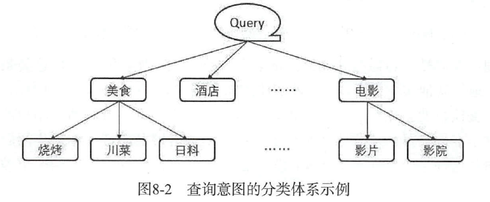
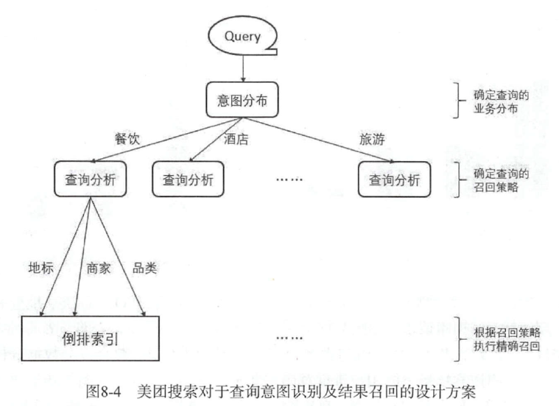
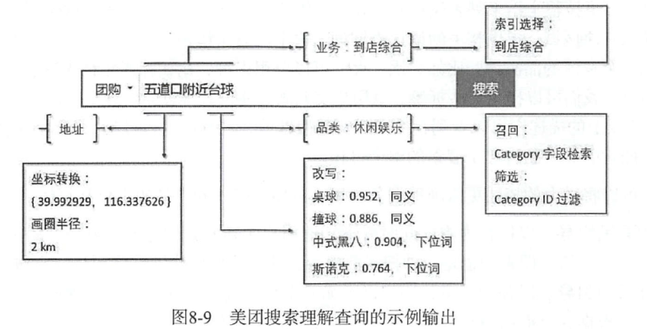

[TOC]

### 8. 搜索

#### query的理解

* 意图识别
  * 用户搜索请求要什么
* 实体识别
  * 尤其O2O场景下，用户的目标往往是某一类实体
* 查询改写
  * 以便更好适配引擎，增强召回
* 紧密度计算
  * 克服词项被分词误切碎而造成分散命中
* 词权重计算
  * 计算分词后，每个词项的权重
* 查询纠错
  * 修改用户可能存在的错误输入

##### 用户查询意图

如何定义； 如何识别

* 将用户意图看作分类
  * 用分类体系表示用户意图，需要大量人工

​       

​	将查询通过某种方法映射到已定义的一个或多个类别

* 用户意图看作聚类
  * 能发现难以观测到的更细的粒度
  * 用户查询被定义成无监督学习生成的多个类簇
* 用户意图看作主题分布
  * 将文本转化成主题向量
  * 由于是无监督学习，主题分布往往难以精确

综述: 针对用户query, 先识别出**所属业务(分类)**, 再识别出**查询词的具体成分**, 从而完成在特定业务分支下，对特定文本领域的检索召回。

* 从用户日志挖掘出的查询词对品类的映射 作为训练样本来构建分类模型
* 成分识别是 实体识别问题

##### 分类器-- 一个多分类和多个二分类

* 多个二分类器，适合横向扩展，业务变化时，只要跟随业务新增或者扩充某个二分类器
  * 弊端：分类器输出得分没有可比性

意图层，只控制某一业务在当前query下，是否应该被召回， 结果的相关性由相关性计算和排序来保证。

##### 查询实体识别与结构化

针对一个查询串，不仅要知道某些连续字符是一个地址串，还要知道这是一个购物中心类型，还要知道是哪一个购物中心。

先进行实体边界切分，判断出实体的边界划分和类别

##### 查询改写

扩充，替换，删除

整串改写的思路 

* Session挖掘
  * 复现用户的查询过程， 用户查某一商品，当他输入查询词获取结果列表后，浏览了一下，并未点击，切换查询，再次搜索并浏览结果列表，反复直至结果页发生点击
  * 可以认为最后发生点击的查询时前面若干个查询词的有效改写
* 二部图搜索
  * 用户输入查询A，并点击结果a，另一个查询B也召回了a，并对其点击，那么查询A和B就通过结果a构成了联系。
  * 通过二部图找出用户行为相似的查询串，这些查询串很大程度上语义相似
  * Simrank， Simrank++

##### 语义的使用

召回与排序

直接用语义向量做召回，还是对其他方式召回的结果作相关性计算，进而影响排序

* 网页搜索中，广告召回
  * 语义向量用于召回，可以匹配到字面匹配不回的结果，并发现隐含语义
* 垂直场景下
  * 业务本身没有什么丰富的隐含语义

##### 语义的使用形式：标签与分布

某些方法可以得到**浮点向量每一维典型的标签**表示，如LDA

用文字化的标签，匹配能力弱化，但有时候也可以根据标签匹配

##### 词权重与相关性

分词后有多个词项，不同的词项对于用户的查询需求有不同的重要性

* TF-IDF 
  * 静态得分，无法考虑同一词项在不同语境的相对重要性
* 基于规则
  * 虚词和实词形容词，名词具有不同的重要性
  * 统计计算，前缀与后缀在统计数据上的重要性
  * 结合**词性，前后缀，词项相对长度与占比**等特征，设计出基于规则的打分

* 基于统计学习

