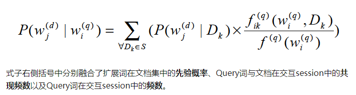

[TOC]

#### 影响搜索结果

* 对短文本的正确理解
  * 实体词识别，纠错
  * 意图分析等
* 长文本良好结构化
  * 关键词抽取
  * 主题词抽取
  * 文本分类等
* 排序模型
  * 召回策略
  * LTR
  * 语义匹配等

##### 改进召回

1. 通过产品分析用户调研来了解什么内容适合在这个搜索场景里展示，然后改检索的字段或公式

2. 用baseline，来观察检索回的内容有什么问题
   1. 可能没有匹配内容
   2. 可能是最匹配的内容排序靠后
   3. 可能除字面匹配，其余内容相关性查
3. 上一些影响召回的模块
   1. Query词权重分配
   2. 动态时效性判断 ？？
   3. Query扩展
      1. 用户输入的query普遍短，2-3词 很难命中需要查找的内容
      2. query中词通常与多个主题关联，se根据简短几个词检索返回的内容可能不是用户所关心的主题
      3. 用户可能只对自己找的东西有一个大致的概念，并不知道词的准确表述， 需要一个类似联想的功能

##### Query扩展

* 先对原始Query若干预处理，包括纠错，补全
* 从Query中筛选出需要进行扩展的主题词或实体词

###### 扩展词从哪里来

* 用户习惯，行为
  * 用户的搜索log有很多搜索词的固定搭配
    * 
  
  * User logs
    * 利用用户搜索一个 query 后改写了的新 query，把两者当作相关关系，用对齐的工具将两者同义词找出
  * Query logs: click
    * 类似的，利用两个 query **点击的相同 doc 构建 query 关**系；
  * Doc：pretrain embedding
    * 用 embedding 的值计算相关性。

* 文档语料
  * 丰富的语境能够提供词之间的相互关系
* 构建领域知识库

###### 扩展模型思路

原始query中的term与待扩展的term/phrase如何产生关联

* 以贝叶斯模型为核心，统计扩展term与query之间的条件概率
  * query词与扩展词在语料中共线值越大，相关性越高 TF-IDF
  * 
  * 适合做baseline
  * Context-Aware Query Suggestion by Mining Click-Through and Session Data
* 把问题抽象成翻译模型，将query中词从src到target改写
  * 对query的直接改写
  
  * The Mathematics of Statistical Machine Translation: Parameter Estimation
  
  * Towards concept-based translation models using search logs for query expansion
  
  * Learning to Rewrite Queries
  
  * Ask the Right Questions: Active Question Reformulation with Reinforcement Learning
  
  * 语料的准备
  
    * 通过用户行为日志来挖掘训练语料。比如从 query 到 title，点击同一 doc 的不同 query，都可形成平行语料。
  
    * 语言模型的过滤
  
      目的是把罕见的表达换为常见的表达。用 ngram 模型算一个得分，把较罕见的放在前面；
  
      ❷ 进行相关性过滤
  
      考虑到点击日志噪声比较多，通过相关性过滤掉噪声；
  
      ❸ 确定切词粒度
  
      用的是 BPE 的 Subword 方法。未用知乎内部的切词是因为未登录词无法预测，同时词表较大，训练速度较慢。
* 增强语义相关性
  * 计算Query到扩展词或改写词的关联
    * 对业务内容的组织，理解和良好的结构化
    * 对语义相关性的增强就可以利用在往期标签生成的文章
    * A User-Centered Concept Mining System for Query and Document Understanding at Tencent
    * 利用大量Query的点击数据，挖掘出该场景下的各种concept词。进一步，我们将concept词与医学知识图谱形成关联，从而替代了前面提到的Query聚类方案。

#####  Query Term Weight

* IDF 统计在该词在语料里出现次数

  * 无法根据query上下文动态适应，不同上下文weight一致

  * 改进: 统计点击数据进行调整

    * 用户的query包含a,b两个term 点击了 doc1，doc4，doc1包含a,b , 而doc4只包含a

      a的权重1，b的权重0.5 ， 从历史日志里把每个query的term权重统计

  * 改进: 通过query语境动态自适应的term weight， 获取query上下文相关的动态词向量，在词向量基础上接MLP就可以预测词权重

    * 例如term词本身的词向量减去query所有词pooling之后的词向量

[知乎搜索框架](https://mp.weixin.qq.com/s?__biz=MzU1NTMyOTI4Mw==&mid=2247496409&idx=1&sn=7b2f5984d71454e1a2812321f6018cf8&scene=21#wechat_redirect)