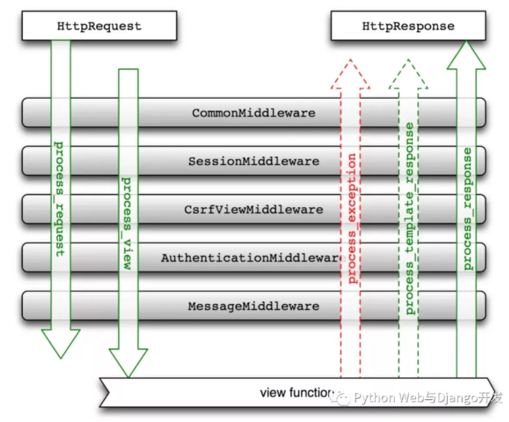

### AJAX CSRF CORS
<!--more-->
#### CSRF Protection

Cross site Request Forgery

当用户没有登出网站，仍保留valid session的时候

针对 safe http op 如 GET HEAD OPTIONS , 不能够用来改变server端的状态

针对 unsafe的 op 如 POST，PUT，DELETE， always 需要一个valid CSRF token


#### CORS

Cross-Origin Resource Sharing 跨域资源共享

* URL由 协议， 域名， 端口， 路径 组成， 两个URL 协议， 域名， 端口相同，则同源

* 前后端分离的跨域问题
  * 后端，前端，分处不同的域名，域名不同，则会有跨域问题

### Django Restful

#### Django Filter

filter_backends 用于过滤查询集的过滤后端 可以在 `DEFAULT_FILTER_BACKENDS` 中配置

配置完之后, http://127.0.0.1:8000/book/?title=&bread=&bcomment=&btitle=%E5%B0%84%E9%9B%95&pub_year=&pub_year__gt=&bread__gt=&breadlt=

上述url的过滤就可以直接在filter中实现

[参考filter使用](https://zhuanlan.zhihu.com/p/110060840)


### ORM的一些操作

queryset 获取对象数据时，如果不指定，则不会检索关联对象的数据，只有当调用关联对象时，queryset会再一次访问数据库

关联对象指的是外键，或者多对多这种关系

#### _set 操作

```python
class Restaurant(models.Model):
    name = models.TextField()
    address = models.TextField(blank=True, default='')
    telephone = models.TextField(blank=True, default='')
    url = models.URLField(blank=True, null=True)
    user = models.ForeignKey(User, default=1,on_delete=models.CASCADE)
    date = models.DateField(default=date.today)

    def __str__(self):
        return self.name
    
class Dish(models.Model):
    name = models.TextField()
    description = models.TextField(blank=True,  default='')
    price = models.DecimalField('USD amount', max_digits=8, decimal_places=2, blank=True, null=True)
    user = models.ForeignKey(User, default=1, on_delete=models.CASCADE)
    date = models.DateField(default=date.today)
    image = models.ImageField(upload_to="myrestaurants", blank=True, null=True)
    restaurant = models.ForeignKey(Restaurant, null=True, related_name='dishes', on_delete=models.CASCADE)
    # Related name "dishes" allows you to use restaurant.dishes.all to access all dishes objects
    # instead of using restaurant.dish_set.all

    def __str__(self):
        return self.name
```

Dish中restaurant是外键, Dish.restaurant 可以知道这道菜的菜馆，反之要知道这个菜馆所有的菜

restaurant.dish_set.all // restaurant.dishes.all


#### models中的抽象类

meta中 Abstract = True， Django认为这个模型是抽象类，就不会在db中创建对应的表


#### select_related

预加载单个关联对象-- 外键关系这种，通常是一对多

```python
# 访问一次数据库，获得Article对象
for a in Article.objects.all():
    # 访问n次数据库，每次循环都要重新检索Category的数据
    print(a.category)

for a in Article.objects.all().select_related('category'):
    # 已经缓存了数据，不会再次访问数据库
    print(a.category)
```

`select_related()`使用JOIN获取了Category模型的数据。 **一篇Article只关联了一个category**

获取外键的外键只需用双下划线隔开

ArticleComment.objects.select_related('article__category')

`select_related`仅限于获取单值关系——外键和一对一关系


#### prefetch_related

预加载多个关联对象

```python
c = Category.objects.get(id=1)
# 这两种方法是等价的，都要访问一次数据库
c.article_set.all()
Article.objects.filter(category=c)


# 查找多个分类下的文章时
# 访问1次数据库，获得分类
for c in Category.objects.all():
    # 访问n次数据库，获得文章
    c.article_set.all()

# 访问2次数据库，获得分类与文章
for c in Category.objects.prefetch_related('article_set'):
    # 直接调用缓存，不再访问数据库
    c.article_set.all()
```

**一个Category绑定了多个Article**

多对多的关系也可以 用prefetch_field 预加载


#### select_related与prefetch_related 区别

当查询的单个主对象或主对象列表 需要用到每个对象的关联对象信息的时候

* 单对单，或单对多外键字段，用select_related
* 多对多ManyToMany, 和反向外键关系， 用prefetch_related
* select_related 执行一次数据库查询，prefetch_related 执行两次数据库查询
* prefetch方法可以给prefetch_related方法增加额外条件和属性


#### select_for_update

select_for_update(nowait=False, skip_locked=False)

返回一个锁住行直到事务结束的查询集，如果数据库支持，它将生成一个SELECT ... FOR UPDATE语句。

例如：

entries = Entry.objects.select_for_update().filter(author=request.user)

所有匹配的行将被锁定，直到事务结束。这意味着可以**通过锁防止数据被其它事务**修改。

一般情况下如果其他事务锁定了相关行，那么本查询将被阻塞，直到锁被释放。使用select_for_update(nowait=True)将使查询不阻塞。如果其它事务持有冲突的锁,那么查询将引发DatabaseError异常。也可以使用select_for_update(skip_locked=True)忽略锁定的行。nowait和skip_locked是互斥的。

目前，postgresql，oracle和mysql数据库后端支持select_for_update()。但是，MySQL不支持nowait和skip_locked参数。


#### 通过外键相连

Django的ForeignKey 和数据库的FOREIGN KEY 不同

* Django是一种逻辑上两个表的关联关系
  * 通过db_constraint = False 可以不生成对应的数据库外键，而是通过生成额外的id来关联两个表 (所谓的软外键)
  * related_name是用来做反向查询的时候用的

```python
from django.db import models

class Province(models.Model):
    name = models.CharField(max_length=16)

    def __unicode__(self):
        return self.name

class City(models.Model):
    name = models.CharField(max_length=16)
    province = models.ForeignKey(Province, null=True,on_delete=models.SET_NULL,
               related_name='cities', db_constraint=False)

    def __unicode__(self):
        return self.name
```

反向查询 例如我想知道某个省有多少个city

p.city_set.all( )

**“子表表名+_set”，注意全部是小写！！表示foreign_key 默认的属性名称。** 

p.cities.all( )

[参考资料](https://zhuanlan.zhihu.com/p/81806204)


#### F 方法更新一个对象或多个对象的某个字段

通常更新数据时，需要先从db将原数据取出来后放在内存，然后编辑，最后提交更新db。使用F方法避免把所有数据先载入内存，而是直接生成SQL语句更新数据库。

但值得注意的是当你使用F方法对某个对象字段进行更新后，需要使用refresh_from_db()方法后才能获取最新的字段信息（非常重要！)

```python
product.price = F('price') + 1
product.save()
print(product.price)            # <CombinedExpression: F(price) + Value(1)>
product.refresh_from_db()
print(product.price)            # Decimal('13.00')
```


### django 优缺点

优点

* 自带大量常用工具 权限管理，分页，auth,完整的文档
* Model的ORM， APP理念可插拔
* 后台admin系统

缺点

* 相对太重，不如flask轻便
* 过度封装，性能偏低(python的锅)


### 缓存

[参考](https://mp.weixin.qq.com/s?__biz=MjM5OTMyODA4Nw==&mid=2247483914&idx=1&sn=368657c4efc342d7d8e26a23f8209eb0&chksm=a73c6232904beb249bd3705fdd09176b97fac5f49f152f846d5d10a3dac34e9ae88614f4e43d&scene=21#wechat_redirect)

对**页面实时性要求不高**的页面。存放在缓存的数据，通常是频繁访问的，而不会经常修改的数据。

- 博客文章。假设用户一天更新一篇文章，那么可以为博客设置1天的缓存，一天后会刷新。
- 购物网站。商品的描述信息几乎不会变化，而商品的购买数量需要根据用户情况实时更新。我们可以只选择缓存商品描述信息。
- 缓存网页片段。比如缓存网页导航菜单和脚部

Django 提供多种缓存方式

* memcached
  * 基于内存，数据存在server
* db
* file system
* 本地内存缓存

禁用用户客户端如浏览器的缓存数据功能 ,用never_cache

```
from django.views.decorators.cache import never_cache

@never_cache
def myview(request):
```


### Request

* request.method: GET, POST
* request.user 当前访问用户的所有信息 
* request.path 当前访问路径
* request.META 是个字典，包含了所有本次HTTP请求的Header信息
  * REQUEST_METHOD: 当前请求方法, GET或POST
  * HTTP_USER_AGENT: 用户浏览器的字符串,
  * REMOTE_ADDR**: 客户端IP地址，**比如54.489.102.201 。
* 当有负载均衡proxy如nginx 时 获取真实 ip
  * 因为每个request中的远程IP地址(request.META["REMOTE_IP"])将指向该负载平衡proxy的地址，而不是发起这个request的用户的实际IP。负载平衡proxy处理这个问题的方法在特殊的 X-Forwarded-For 中设置实际发起请求的IP。 因此，需要一个中间件来确保运行在proxy之后的站点也能在request.META['REMOTE_ADDR']中得到正确的IP。

```python
from django.shortcuts import render


def index(request):
    user = request.user
    user_agent = request.META.get('HTTP_USER_AGENT', 'unknown')
    x_forwarded_for = request.META.get('HTTP_X_FORWARDED_FOR', '')

    if x_forwarded_for:
        ip = x_forwarded_for.split(',')[0]  # 所以这里是真实的ip
    else:
        ip = request.META.get('REMOTE_ADDR')  # 这里获得代理ip

    context = {'user': user, 'user_agent': user_agent, 'ip': ip, }

    return render(request, "request_demo/index.html", context)
```


### QuerySet 用法


### 权限管理

什么用户对什么对象有什么样的权限

Django的权限permission本质django.contrib.auth中的一个模型，与User的user_permissions字段多对多关系。在installed_app中添加auth应用后，Django为每个app中的model自动创建4个可选权限， view,add,change,delete

* 用户权限的查看
  
* user_A.has_perm("blog.add_article")
  
* 用户所在组的权限或某个用户的所有权限

  * user_A.get_group_permissions()
  * user_A.get_all_permissions()

* 手动定义和分配权限

  * django自带的四种权限不够，自定义权限
    * 在Model的meta属性中添加permissions
    * 使用ContentType程序化创建permissions

* 用户权限的验证

  * 视图中

    * 基于函数的视图 @permission_required( perm , login_url=None, raise_exception=False )

      ```python
      from django.contrib.auth.decorators import permission_required
      
      @permission_required('polls.can_vote')
      def my_view(request):
          ...
      ```

    * 基于类的视图 继承 PermissionRequiredMixin

      ```python
      from django.contrib.auth.mixins import PermissionRequiredMixin
      
      class MyView(PermissionRequiredMixin, View):
          permission_required = 'polls.can_vote'
          # Or multiple of permissions:
          permission_required = ('polls.can_open', 'polls.can_edit')
      ```

* 用户组(Group)

  * Group和User是多对多的关系，在权限控制时批量对用户的权限进行管理和分配
  * 将一个用户加入一个group后，就拥有这个group分配到的所有权限

* 不足

  * Django自带的权限是针对模型的，意味着一个用户对Article模型有change的权限，那么该用户有对所有的文章对象进行修改的权限，
  * 若想要实现对单个文章对象的权限管理，需要借助 **django guardian**


### Django 用户登录

借助django-allauth 实现用户注册，登录，登出，找回密码，第三方登录等功能。

[参考](https://zhuanlan.zhihu.com/p/70186446)

[参考](https://zhuanlan.zhihu.com/p/37960481)


### Django常用装饰器

* @login_required(login_url = '...')
  * 执行视图函数前检查用户是否通过登录身份验证，login_url 可选，默认是settings.py中的LOGIN_URL
  * 不会检查用户是否是is_active的状态，进一步限制登录成功的用户对某些视图函数的访问，用下面这个
* @user_passes_test
  
* 对登录用户对象的信息进行判断,只有通过测试的用户才能访问视图函数
  
* @permission_required( perm, login_url)
  
* 检查用户是否有特定权限
  
* @cache_page

* @cache_control

  * 用户自己浏览器的缓存 (Private)   @cache_control(private = True)
  * 服务提供者(服务端)的缓存 (Public

* @method_decorator

  * 需要在基于类的视图上使用装饰器

    ```python
    from django.contrib.auth.decorators import login_required
    from django.utils.decorators import method_decorator
    from django.views.generic import TemplateView
    
    @method_decorator(login_required, name='dispatch')
    class ProtectedView(TemplateView):
        template_name = 'secret.html
    ```

* @require_http_methods

  * 限制用户的请求方法

    ```python
    from django.views.decorators.http import require_http_methods
    
    @require_http_methods(["GET", "POST"])
    def my_view(request):
        # Only accept GET or POST method
        pass
    ```

    


### Path与Re_path的不同

Django的URL设计有path和re_path两种方式，你需要仔细观察两者的相同点和共同点:

- 相同点：结尾一般是需要有斜线"/"的。
- 不同点：re_path需要小"r"注明正则匹配，已"^"开头，已"$"结尾。


如果不按规范写，你的URL可能永远都匹配不到你想要的内容。如果你习惯了开发RESTful API，你还需要知道Django URL设计与RESTful API URI设计的不同。


- **RESTful API URI的结尾不能加"/"**，Django URL需要
- RESTful API URI不能包含动词，只能是名词，Django URL很常用。
- RESTful API URI代表资源的名字要以复数命名，Django URL无所谓。


### Models的继承

* 抽象模型继承 abstract model
* 多表模型继承 multi-table 
* 代理模型 proxy model

#### abstract model

两个模型有许多共同的字段， 提取共同字段建立一个父级抽象模型

```python
class ItemBase(models.Model):
    owner = models.ForeignKey(User, on_delete=models.CASCADE)
    # owner = models.ForeignKey(User,related_name='%(class)s_related',on_delete=models.CASCADE)
    # 这样模型继承后，每个子类模型会生成自己专属的related_name, 比如articles_related和courses_related。
    title = models.CharField(max_length=250)
    created = models.DateTimeField(auto_now_add=True)
    updated = models.DateTimeField(auto_now=True)

       class Meta:
        abstract = True
    def __str__(self):
        return self.title

class Article(ItemBase):
    body = models.TextField()

class Course(ItemBase):
    description = models.TextField()
```

建立一个父类抽象模型，只需要在父类模型Meta选项中设置abstract=True。Django不会为抽象模型在数据库中生成自己的数据表**。父类Meta中的abstract=True也不会传递给子**类


#### 多表模型继承

其与抽象模型继承最大的区别在于Django也会为父类模型建立自己的数据表，同时隐式地在父类和子类之间建立一个一对一关系

删除了父类模型Meta选项中的abstract=True, 这样Django就会**创建3个数据表**。其中**共有字段部分会存储在父类模型对应的数据表里**，每个子类模型专属的字段会存在每个子类对应的数据表里。尽管共有字段是存在父类模型对应的数据表里，**每个子类对象可以像使用自己数据表里的字段一样使用那些字段**，比如article.title, course.owner。

在多表继承中，一般父类的Meta属性不会继承到子类中，但是ordering和 get_latest_by是可以继承的。如果子类不想继承父类的ordering的Meta选项，则可以手动显式的指定ordering=[]或者任何自己想要的值

多表继承中如果一个父类有多个子类，且子类不在关系中显式地指定related_name字段，django会引发验证错误。这是因为多表继承的时候，Django隐式地在父类和子类之间建立一个一对一关系，有时候父类与其他类的关系会从父类下移到子类中。


#### 代理模型

如果我们只想改变某个模型的行为方法，而不是添加额外的字段或创建额外的数据表，我们就可以使用代理模型(proxy model)。设置一个代理模型，需要在子类模型Meta选项中设置proxy=True**， Django不会为代理模型生成新的数据表**。

```python
from django.db import models

class Person(models.Model):
    first_name = models.CharField(max_length=30)
    last_name = models.CharField(max_length=30)

class MyPerson(Person):
    class Meta:
        proxy = True
ordering = ['last_name']
```


### Signals

* “信号分发器”机制，允许**解耦的应用在框架的其它地方发生操作时会被通知到**。 通俗而讲Django信号的工作原理就是当**某个事件发生的时候会发出一个信号(signals), 而监听这个信号的函数(receivers)就会**立即执行。

* 尤其是**用于不同模型或程序间的联动**。常见例子包括创建User对象实例时创建一对一关系的UserProfile对象实例，或者每当用户下订单时触发给管理员发邮件的动作。

样例

有一个如下User模型，我们希望每次有User对象新创建时都打印出有新用户注册的提示信息

信号发送者**sender是User模型**，每当User模型执行post_save动作时就会发出信号。此时我们自定义的create_user函数一旦监听到User发出的post_save信号就会执行，先通过if created判断对象是新创建的还是被更新的；如果对象是新创建的，就会打印出提示信息。

```python
from django.db import models
from django.db.models import signals
from django.dispatch import receiver

class User(models.Model):
    name = models.CharField(max_length=16)
    gender = models.CharField(max_length=32, blank=True)

def create_user(sender, instance, created, **kwargs):
    if created:
        print("New user created!")

# 信号(post_save)自带的connect的方法将自定义的函数与信号发出者(sender)User模型进行了连接。
post_save.connect(create_user, sender=User)

# 使用@receiver装饰器实现发送者与监听函数的连接
@receiver(post_save, sender=User)
def create_user(sender, instance, created, **kwargs):
    if created:
        print("New user created!")
```


实现不同模型的联动更新

有一个Profile模型，与User模型是一对一的关系。我们希望创建User对象实例时也创建Profile对象实例，而使用post_save更新User对象时不创建新的Profile对象。

由于post_save可同时用于模型的创建和更新，我们用if created这个判断来加以区别

```python
from django.db import models
from django.db.models.signals import post_save
from django.dispatch import receiver

class Profile(models.Model):
    user = models.OneToOneField(User, on_delete=models.CASCADE)
    birth_date = models.DateField(null=True, blank=True)

@receiver(post_save, sender=User)
def create_user_profile(sender, instance, created, **kwargs):
   if created:
       Profile.objects.create(user=instance)

@receiver(post_save, sender=User)
def save_user_profile(sender, instance, **kwargs):
    instance.profile.save()
```


#### Django 内置的信号

之前的例子中我们使用的都是post_save信号，即在模型调用save()方法后才发送信号。Django其它常用内置信号还包括:

- django.db.models.signals.pre_save & post_save在模型调用 save()方法之前或之后发送。
- django.db.models.signals.pre_init& post_init在模型调用_init_方法之前或之后发送。
- django.db.models.signals.pre_delete & post_delete在模型调用delete()方法或查询集调用delete() 方法之前或之后发送。
- django.db.models.signals.m2m_changed在模型多对多关系改变后发送。
- django.core.signals.request_started & request_finished Django建立或关闭HTTP 请求时发送。


假如我们有个account的app，包含了User和Pofile模型，我们不仅需要在account文件夹下**新建signals.py**，还需要修改account文件下apps.py和`__init__`.py，以导入创建的信号监听函数。


account/signals.py

```python
from django.db.models.signals import post_save
from django.dispatch import receiver
from .models import User, Profile

@receiver(post_save, sender=User)
def create_user_profile(sender, instance, created, **kwargs):  
    if created:      
        Profile.objects.create(user=instance)
        
@receiver(post_save, sender=User)
def save_user_profile(sender, instance, **kwargs):    
    instance.profile.save()
```

*# account/apps.py*

```python
from django.apps import AppConfig

class AccountConfig(AppConfig):
    name = 'account'

    def ready(self):
        import account.signals
```

*# account/`__init__`.py*

```
default_app_config = 'account.apps.AccountConfig'
```


### 中间件

MiddleWare是嵌入都django的request/response处理机制中的一个hooks，可以修改django 全局输入或输出

* HTTP Web服务器工作原理一般都是接收用户发来的请求(request), 然后给出响应(response)。
* Django也不例外，其一般工作方式是接收request对象和其它参数，**交由视图(view)处理**，然后给出它的响应(respone)数据: 渲染过的html文件或json格式的数据。
* 在实际工作中Django**并不是接收到request对象**后，马上交给视图函数或类(view)处理，也不是在view执行后立马给用户返回reponse。
* 事实上Django最初接收的是**HttpRequest对象**，而不是request对象，正是**中间件的作用把HttpRequest对象和user对象打包成了一个全局变量request对象**，这样你才可以View中使用request作为变量或者在模板中随意调用request.user。

HttpRequest -> Middleware -> View -> Middleware -> HttpResponse

正是由于一个请求HttpRequest在传递给视图View处理前要经过中间件处理，经过View处理后的响应也要经过中间件处理才能返回给用户，我们可以编写自己的中间件实现权限校验，限制用户请求、打印日志、改变输出内容等多种应用场景，

- 禁止**特定IP地址的用户或未登录的用户**访问我们的View视图函数
- 对同一IP地址单位时间内发送的请求数量做出限制
- 在View视图函数执行前记录用户的IP地址
- 在View视图函数执行前传递额外的变量或参数
- 在View视图函数执行前或执行后把特定信息打印到log日志
- 在View视图函数执行后对reponse数据进行修改后返回给用户


中间件对**Django的输入或输出的改变是全局的，**反之亦然。如果让你希望对Django的输入或输出做出全局性的改变时，需要使用中间件。另外Django对POST表单中携带的CSRF token的全局校验也是通过CsrfViewMiddleware这个中间件进行的


- SecurityMiddleware：为request/response提供了几种安全改进，无它不安全
- SessionMiddleware：开启session会话支持，无它无session
- CommonMiddleware：基于APPEND_SLASH和PREPEND_WWW的设置来重写URL，如果APPEND_SLASH设为True，并且初始URL 没有以斜线结尾以及在URLconf 中没找到对应定义，这时形成一个斜线结尾的新URL；如果PREPEND_WWW设为True，前面缺少 www.的url将会被重定向到相同但是以一个www.开头的url。
- CsrfViewMiddleware：添加跨站点请求伪造的保护，通过向POST表单添加一个隐藏的表单字段，并检查请求中是否有正确的值，无它无csrf保护
- AuthenticationMiddleware：在视图函数执行前向每个接收到的user对象添加HttpRequest属性，表示当前登录的用户，无它用不了request.user
- MessageMiddleware：开启基于Cookie和会话的消息支持，无它无message
- XFrameOptionsMiddleware：对点击劫持的保护

如果你要实现全站缓存, 还需要使用UpdateCacheMiddleware和FetchFromCacheMiddleware，但一定要注意它们的顺序，Update在前和Fetch在后。

```
MIDDLEWARE = ['django.middleware.cache.UpdateCacheMiddleware', 
			  'django.middleware.common.CommonMiddleware'， 'django.middleware.cache.FetchFromCacheMiddleware',]
```

除此以外Django还提供了压缩网站内容的**GZipMiddleware，**根据用户请求语言返回不同内容的**LocaleMiddleware**和给GET请求附加条件的**ConditionalGetMiddleware。**这些中间件都是可选的。


当你在settings.py注册中间件时一定要要考虑中间件的执行顺序，中间件在request到达view之前是从上向下执行的，在view执行完后返回reponse过程中是从下向上执行的，如下图所示。举个例子，如果你自定义的中间件有依赖于request.user（比如判断用户是否登录)，那么你自定义的中间件一定要放在AuthenticationMiddleware的后面。



#### 自定义中间件

支持 函数和类 两种方式定义

```python
def simple_middleware(get_response):
# One-time configuration and initialization. 一次性设置和初始化

    def middleware(request):
        # Code to be executed for each request before the view (and later middleware) are called.
        # request请求到达视图函数执行前的代码

        response = get_response(request)

        # Code to be executed for each request/response after
        # the view is called. 视图函数执行后的代码

        return response

    return middleware


class SimpleMiddleware:
    def __init__(self, get_response):
        self.get_response = get_response
        # One-time configuration and initialization.一次性设置和初始化

    def __call__(self, request):
        # Code to be executed for each request before the view (and later middleware) are called.
        # 视图函数执行前的代码

        response = self.get_response(request)

        # Code to be executed for each request/response after
        # the view is called. 视图函数执行后的代码

        return response
```


django版本是1.x或2.x版

```python
from django.utils.deprecation import MiddlewareMixin 
class MyMiddleware(MiddlewareMixin):
    def process_request(self, request):
        print("Request before view is called!")

    def process_response(self, request, response):
        print("Response after view is called!")
        return response

    def process_exception(self, request, exception):
        print("Exception!")
```


希望在视图函数执行请求前或执行请求后添加额外的功能，且这种功能是全局性的（针对所有的request或view或response), 那么使用中间件是最好的实现方式。


#### Django 文件的上载

* Django提供 FileField 和 ImageField 字段用于文件上传用
* 默认情况，Django会store file locally, 用 `MEDIA_ROOT` 和 `MEDIA_URL` settings
* 与此同时，Django也提供 custom file storage systems， 允许自定义 where and how Django 存储文件
  * FileField(upload_to = ... , storage = )


### 限制用户上传文件格式与大小

[参考](https://mp.weixin.qq.com/s?__biz=MjM5OTMyODA4Nw==&mid=2247484260&idx=1&sn=f55f51f3a845e2b9bb6fca67b8909edd&chksm=a73c635c904bea4aaefe634d95128116fca657b49531ccc4f71ad050c727e03ba17546fd5b0a&scene=178#rd)

扩展FileField 字段


### **nginx 和 uWISG 服务器之间如何配合工作的**

- 首先浏览器发起 http 请求到 nginx 服务器，Nginx 根据接收到请求包，进行 url 分析,

  判断访问的资源类型。如果是静态资源，直接读取静态资源返回给浏览器。

- 如果请求的是动态资源就转交给 uwsgi服务器。

- uwsgi 服务器根据自身的uwsgi 和 WSGI 协议，找到对应的 Django 框架。

- Django 框架下的应用进行逻辑处理后，将返回值发送到 uwsgi 服务器。

- uwsgi 服务器再返回给 nginx，最后 nginx将返回值返回给浏览器进行渲染显示给用户。


### **Django项目如何实现高并发**

- 使用nginx进行反向代理和负载均衡
- 数据库分库和读写分离(含主从复制)
- 使用nosql数据库比如redis缓存热点数据
- 耗时任务（比如发邮件或写入操作)交由celery异步处理
- 使用Gzip或django-compressor压缩静态文件
- 使用CDN加速静态文件访问


###  **什么是wsgi,uwsgi,uWSGI**

Web服务器网关接口,是一套协议。用于接收用户请求并将请求进行初次封装，然后将请求交给web框架。实现wsgi协议的模块有：

1.wsgiref,本质上就是编写一个socket服务端，用于接收用户请求(django)

2.werkzeug,本质上就是编写一个socket服务端，用于接收用户请求(flask)

uwsgi:

与WSGI一样是一种通信协议，它是uWSGI服务器的独占协议,用于定义传输信息的类型

uWSGI:

是一个web服务器,实现了WSGI协议,uWSGI协议,http协议,


### 各种插件

#### django生成model之间ER图

```
pip install django-extensions
```

```
# 全部models生成dot
python manage.py graph_models -a > all.dot
# 单个app生成dot
python manage.py graph_models testApp > testApp.dot
```

```
# 转换dot文件为png图片
sudo apt install graphviz
dot -Tpng testApp.dot > testApp.png 
```
