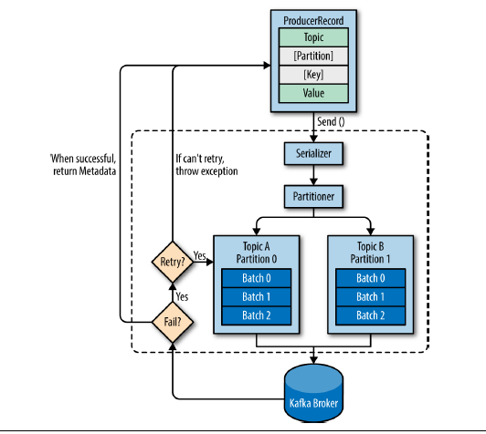

#### 消息队列
<!--more-->
##### 模式一： 点对点

一对一，消费者主动拉取数据，数据收到后消息清除。 Kafka 是这一种模式

好处：适用于客户端A(发送数据方)和客户端B(消费数据方)的速度不匹配。

缺点：需要消息接收方开一个进程实时监控消息发送方是否有消息

##### 模式二：发布/订阅模式

一对多,数据生产后发送给所有的订阅者

好处：不用进程监听

坏处：不同的订阅者之间速度可能不匹配


#### producer的写入流程


确保producer这边的数据都能够写入kafka的机制是 ACK，由kafka这边反馈一个信号(0,1,all)


消息中间件(MQ or Message Broker)

* 解耦消息的生产和消费
* 缓冲


消息生产完， 发布主题

消息订阅主题，获取最新消息


#### Kafka 一代 消息队列

* 队列保证FIFO

* 由于订阅了某条消息的Customer数量可以是0，也可能是多个，所以不能消费完，就删除消息
* Kafka 会对消息 持久化存储 (时间可以配置)
* 对于每个Customer，会记录一个offset 标志该Customer 消费到哪条数据

缺点

* Topic 太多，一个只订阅了topicA 的customer要在一个有ABCDF 等等topic的消息队列中 找topic为A的消息
* 吞吐量低 全部消息都放在一条队列，请求一多会炸


#### Kafka二代 Partition

分布存储

* 多条队列，每条队列里存的都是同一个topic的的消息，也提高了吞吐量

缺点

* 不满足高可用，机器挂掉就不行了 单点系统


#### Kafka三代 Broker 集群

kafka中，集群里每个实例叫broker。 每个实例不一定是一个server


同一个topic可以被分成好几个partition


参考 https://zhuanlan.zhihu.com/p/37405836

#### Kafka的消息结构


#### Zookeeper 和 Kafka的关系

* 管控各个broker，当某个broker中的leader断了之后，去调度
* store metadata about the Kafka cluster , as well as consumer client details

#### 数据可靠性和重复消费

* 生产者把消息发给Kafka，发送过程中挂掉、或者Kafka保存消息时发送异常怎么办？
* 消费者获取消费时发生异常怎么办？
* 消费者已经消费了数据，但是修改offset时失败了，导致重复消费怎么办？

#### pull or push

消费者侧在获取消息时，是通过主动去pull消息呢？还是由Kafka给消费者push消息？

是消费者通过pull机制去获取消息

#### 提高消费者处理性能


#### 集群搭建

##### 搭建zookeeper 集群

每台机子都重复下面的操作

默认安装了Java环境

```bash
cp config/zoo_sample.cfg config/zoo.cfg
```

修改zoo.cfg的内容

```bash
tickTime=2000 #1 * tickTime是客户端与zk服务端的心跳时间，2 * tickTime是客户端会话的超时时间。 
dataDir=/home/myname/zookeeper
clientPort=2181 # zk服务进程监听的TCP端口
initLimit=5
syncLimit=2
server.1=192.168.229.160:2888:3888
server.2=192.168.229.161:2888:3888
server.3=192.168.229.162:2888:3888
```

在/home/myname/zookeeper 下生成 myid内容就是id数

启动服务

```bash
bin/zkServer.sh start # 使得zk服务进程在后台进行
```

```bash
bin/zkServer.sh start-foreground #在前台运行,以便查看服务器进程的输出日志
```

连接

```bash
bin/zkCli.sh -server 192.168.0.1:2181
```

连接集群

```
bin/zkCli.sh -server 192.168.229.160:2181,192.168.229.161:2181,192.168.229.162:2181
```


##### 搭建kafka集群

参考 https://ken.io/note/kafka-cluster-deploy-guide#H3-14


#### kafka the definitive guide


consumer 数目 大于 partition 数目

* 多的consumer处于闲置状态，因为一个partition最多可以被一个consumer 消费？

consumer 数目  小于 partition 数目

* 存在一个consumer消费多个partition的情况


##### Producer




* Produce message to Kafka 

  * create a ProducerRecord

  * serialize the kay value objects into ByteArrays

    * so that they can be sent to network

  * data is sent to a partitioner

    * usually based on key to pick a partition for the data

    


##### Customer

* multiple consuers  are subscribed to a topic and belong to the same **consumer group**
  * each consumer receive message from a different subset of partitions in the topic


consumer 通常做的是high-latency operation 比如写入db 或者 耗时的计算操作，因此添加更多的consumer可以share load，每个consumer 负责一部分partition

* consumer 数量没必要超过 partition 数目，超过的部分consumer idle

* 创建topic的时候可以设置多一点partition


对于一个topic中的message，可能被多个application用到，为了让每个application都能得到topic中的所有数据，每个application对应一个consumer group。

Q：当一个consumer group 消费了topic中的消息后， 另一个consumer group还能拿到被其他consumer group 消费过的数据吗？是的

因为被消费过的数据并不会被马上销毁，每个customer 可以根据各自的offset 查看他们在各个partition中的位置


consumer group中动态增加 consumer 或者减少时，这个consumer 会消费曾经是被其他consumer消费的partition。 修改 partition的 ownership过程叫做 rebalancing， 这个过程中，整个consumer group的consumer都是不能consume message状态

> The way consumers maintain membership in a consumer group and ownership of the partitions assigned to them is by sending heartbeats to a Kafka broker designated  as the group coordinator


> If the consumer stops sending heartbeats for long enough, its session will time out
> and the group coordinator will consider it dead and trigger a rebalance


一个 consumer 可以订阅多个 topic，也可以通过正则的方式去匹配多个topic

* 当用户创建一个新的topic时，rebalance就会发生，consumers 就会开始订阅新的 topic


POLL Loop

consumer 通过polling the server 来得到更多的data


commit： the action of updating the current position in the partition.

rebalance后, 每个consumer对应的partition可能会变，因此就会read the lattest committed offset of each partition 然后从那里继续


