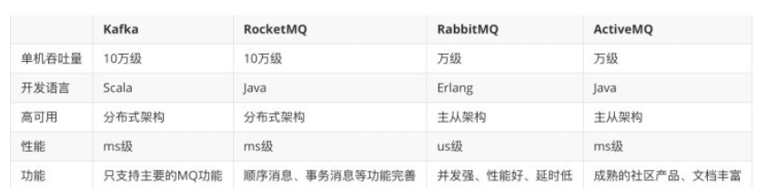

消息队列

对实时一致性要求没那么高的请求，通过MQ异步的方式处理

#### 问题

* 异步带来的不一致问题

  * 通过job去重试保证接口调用成功

* 消息可靠性的保证

  消息的丢失

  * 生产者丢失
    * 程序发送失败抛异常没有重试处理，或者发送过程成功，但过程中网络问题MQ没收到
    * 异步发送消息的方式
      * 异步有回调
      * 异步无回调
        * 生产者发送完消息后不管结果就可能会造成消息丢失
    * 异步发送 + 回调通知 + 本地消息表

  * MQ丢失
    * 生产者保证消息发送到MQ，但MQ收到消息后还在内存中，这时宕机了来不及同步到从节点没导致消息丢失
  * 消费者丢失
    * 消费者刚收到消息，此时server宕机，MQ人为消费者已经消费，不重复发送消息
    * 消费方不返回ACK确认，重发的机制根据MQ类型的不同发送时间间隔，次数不尽相同，重试超过次数之后进入死信队列，需要手动处理

* 消费者消费失败，一直消费失败导致消息积压

  * 如果容易修复，先把问题修复，让consumer恢复正常消费

  * 如果时间来不及处理很麻烦，做转发处理，写一个临时的consumer消费方案，先把消息消费，然后再转发到一个新的topic和MQ资源，这个新的topic的机器资源单独申请，要能承载住当前积压的消息

  * 处理完积压数据后，修复consumer，去消费新的MQ和现有的MQ数据，新MQ消费完成后恢复原状

    

    

