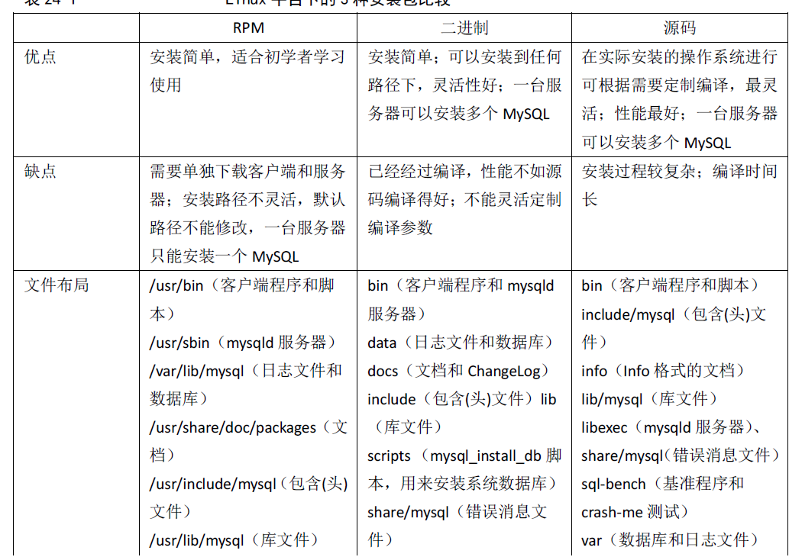

ubuntu 18.04 - mysql 5.7


### 安装与配置
#### 1. 安装
<!--more-->
```bash
sudo apt update
sudo apt install mysql-server
```

#### 2. 配置

运行安全脚本

```
sudo mysql_secure_installation
```

#### 3. 验证mysql安装

```
systemctl status mysql.service
```

#### 4. 登录mysql

```
sudo mysql -uroot -p
```

10.127.3.101 mysql -root -xyu3

#### 5. 设置远程连接

```
sudo vim /etc/mysql/mysql.conf.d/mysqld.cnf
```

```
bind-address = 0.0.0.0
# bind-address = 127.0.0.1
```

需要进入 MySQL 程序修改 root 账户的远程访问的权限。如果这一步不执行，则远程用 Navicat 访问时，会报 1130 错误。

```
GRANT ALL PRIVILEGES ON *.* TO 'root'@'%' IDENTIFIED BY '您的数据库密码' WITH GRANT OPTION;
GRANT ALL PRIVILEGES ON *.* TO 'root'@'%' IDENTIFIED BY 'xyu3' WITH GRANT OPTION;
```

刷新权限

```
flush privileges;
```

最后最好重启服务器。

### mysql用户

#### 1. 创建用户

```
CREATE USER 'username'@'host' IDENTIFIED BY 'password';
CREATE USER 'xyu3'@'%' IDENTIFIED BY 'xyu3';
```

* host：指定该用户在哪个主机上可以登陆，如果是本地用户可用localhost，如果想让该用户可以**从任意远程主机登陆**，可以使用通配符`%`
* password：该用户的登陆密码，密码可以为空，如果**为空则该用户可以不需要密码登陆服务**器

```
sample:
CREATE USER 'pig'@'%' IDENTIFIED BY '123456';
```


#### 2. 授权

```
GRANT privileges ON databasename.tablename TO 'username'@'host'
```

* privileges：用户的操作权限，如`SELECT`，`INSERT`，`UPDATE`等，如果要授予所的权限则使用`ALL`

* databasename：数据库名

* tablename：表名，如果要授予该用户对所有数据库和表的相应操作权限则可用`*`表示，如`*.*`

```
GRANT SELECT, INSERT ON test.user TO 'pig'@'%';
GRANT ALL ON *.* TO 'xyu3'@'%';
```


#### 3. 设置与更改用户密码

```
SET PASSWORD FOR 'username'@'host' = PASSWORD('newpassword');
## 样例
SET PASSWORD FOR 'pig'@'%' = PASSWORD("123456");
```


#### 4.  撤销用户权限

```
REVOKE privilege ON databasename.tablename FROM 'username'@'host';
```

##### 注意:

假如你在给用户`'pig'@'%'`授权的时候是这样的（或类似的）：`GRANT SELECT ON test.user TO 'pig'@'%'`，则在使用`REVOKE SELECT ON *.* FROM 'pig'@'%';`命令并不能撤销该用户对test数据库中user表的`SELECT` 操作。相反，如果授权使用的是`GRANT SELECT ON *.* TO 'pig'@'%';`则`REVOKE SELECT ON test.user FROM 'pig'@'%';`命令也不能撤销该用户对test数据库中user表的`Select`权限。

具体信息可以用命令`SHOW GRANTS FOR 'pig'@'%';` 查看。


#### 5. 删除用户

```
DROP USER 'username'@'host';
```


### mysql操作

#### 1.重启mysql

```
sudo service mysql restart
```

#### 2.查看状态是否启动

```
sudo service mysql status
```




### 参考链接

[1.关于安装mysql](https://wangxin1248.github.io/linux/2018/07/ubuntu18.04-install-mysqlserver.html)

[2.关于用户操作之类的](https://www.jianshu.com/p/d7b9c468f20d)