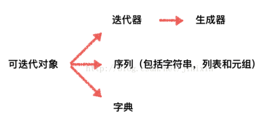

[解决哈希冲突](#解决哈希冲突)
[dict实现原理](#dict实现原理)  
[list和set查询谁复杂度低](#list和set查询谁复杂度低)  
[else与for,while,try使用](#else与forwhiletry使用)    
[eval函数](#eval函数)  
[is not None](#is_not_none)   
[is和==的区别](#is和的区别)  
[运算符重载](#运算符重载)  
[装饰器闭包内的变量存在哪里](#装饰器闭包内的变量存在哪里)  

[pyc,so文件](#pyc文件so文件)  
[python和java,C++的区别](#python和javac的区别)  
[type和object的关系](#type和object的关系)  


[上下文管理器](#上下文管理器)  
[python中的高阶函数](#python中的高阶函数)  
[python特殊方法](#python特殊方法)  
[python菱形继承](#python菱形继承)  
[super关键字实现,python多继承](#python多继承子类调用一个父类的方法怎么做super关键字的具体实现方式)  


[线程安全的单例设计模式](#线程安全的单例设计模式)  

[函数_和__情况](#函数_和__情况)  
[函数的参数](#函数的参数)  
[基础数据类型,可变,不可变](#基础数据类型可变不可变)  
[深拷贝浅拷贝](#深拷贝浅拷贝)  
[用python调用系统命令用什么模块](#用python调用系统命令用什么模块)  

[序列迭代](#序列迭代)  
[itertools 库](#itertools库)  
[标准迭代器Iterator接口](#标准迭代器iterator接口)  
[迭代,生成器,generator如何实现](#迭代生成器generator如何实现)  
<!--more-->


#### 装饰器/闭包内的变量存在哪里
[装饰器参考](https://stackoverflow.com/questions/739654/how-to-make-a-chain-of-function-decorators/1594484#1594484)
* 例如统计函数运行时间，打印日志
* 函数装饰器和类装饰器
* 本质也是个闭包
  * 它能访问定义体之外定义的非全局变量
  * 外函数返回内函数的引用
* 外函数把临时变量绑定给内函数
  * 通常一个函数结束时会把变量都释放给内存空间，但外部函数发现临时变量在内部函数会用到，就会把临时变量绑定到内函数
* 修改外函数临时变量
  * 方法一: python3 支持nonlocal参数，表明这个变量不是局部变量空间的变量，需要向上一层变量空间找这个变量
  * 方法二：把闭包变量改成可变类型数据进行修改
[深入理解python中闭包，闭包的实质](https://blog.csdn.net/pushiqiang/article/details/79282118)

#### 上下文管理器 
基本语法
```python
with EXPR as VAR:
	BLOCK
with open("file.txt","r") as f: #上下文表达式
    lines = f.readlines()
# 上下文管理器: open("file.txt","r") 
```

上下文管理协议

* 一个类中实现了 `__enter__` ,  `__exit__`

场景
* 更优雅的方式操作(创建/获取/释放)资源 如文件操作，数据库连接
* 处理异常更优雅

#### 解决哈希冲突
* 拉链法
  * 在发生哈希冲突的地方接链表
  * Java的HashMap用的就是链表+红黑树
* 开放地址法
  * 关键特征是所有输入元素全部存放在哈希表中
  * 发生哈希冲突时，以当前地址为基准，根据某种寻址方式，去寻找下一个地址，若发生冲突再去寻找，直到一个为空的地址为止
  * 寻址方法
    * 线性探查
    * 二次探查
    * 伪随机探测


#### list,tuple,set,dict原理
* list
  * 在Cpython中,实现为长度可变的数组,对其它对象的引用组成的连续数组.
* tuple
  * 本质也是数组,大小固定
* dict
  * 伪随机探测(pseudo-random probing)的散列表(hash table)
  * key需要是可哈希的对象,py中所有不可变的内置类型都是可哈希的
  * 可以通过列表推导的方式创建`squares = {number: number**2 for number in range(10)}`
  * py3中dict的keys,values,items返回的是视图对象(viewing objects),可以用于动态查看字典内容，每次dict内容变化，视图也会对应改变
* OrderedDict
  * py3.6之后 dict的实现也是insert-ordered
  * collections模块中,为了保证key插入的顺序
  * 内部使用循环双向链表记录记录插入顺序
  * [参考说明](https://frostming.com/2016/07-07/python-you-xu-zi-dian-de-shi-xian)
* Set
  * set()
    * 可变,无序,有限
    * 元素唯一, 不可变, 可哈希
  * frozenset()
    * 不可变,可哈希,无序
    * 元素唯一不可变, 可哈希
* 集合被实现为带有**空值**的字典，只有键才是实际的集合元素


#### list和set查询,谁复杂度低
* list 的底层实现
  * 长度可变的数组，对其他对象的引用组成的连续数组 
  * index() 查找元素 O(N),  pop(i) O(N)
* 集合的底层实现
  * 集合有两种
    * set() 可变，无序，有限
    * frozenset() 不可变 可哈希 无序
  * 带**有空值的字典**，只**有键才是集合**的元素
* if  i in list 和  if  i in set 哪个快
  * set快 set是算哈希 O(1) 平均， 而list是 O(n)

#### dict实现原理
* dict 实现原理
  * 伪随机探测(pseudo-random probing)的散列表(hash table)作为字典的底层数据结构
  * 可哈希的对象作为字典的键
    * python内置的所有**不可变的内置类型都是可哈希**的，可变类型不可哈希

#### 基础数据类型可变,不可变

* 可变: list, set, dict
  * 可变对象变化后，地址没变 (可以用 id() 来查看地址)
* 不可变: int , float,string,bool,** tuple**

#### 深拷贝,浅拷贝

* a=b 不算拷贝，a=b只是把a的指针指向b的地址，

  ```bash
  >>>a = (1, 2, 3)
  >>>id(a)
  2139167074776
  >>> b = a
  >>> a = (4, 5, 6) 这个赋值会让 a指向另一个地址，而b只是指向原来那个地址
  >>> a
  (4, 5, 6)
  >>> b
  (1, 2, 3)
  >>> id(a)
  2139167075928
  >>> id(b)
  2139167074776
  ```

```
a = '123'
b = a
# 浅拷贝
c = copy.copy(a)
# 深拷贝
d = copy.deepcopy(a)
```

* 浅拷贝 按被拷贝的对象区分

  * 不可变 (int tuple，string)

    * 情况等价于 "=" 对象的id值与浅拷贝原来的值相同
  * 针对不可变对象，浅拷贝也是创建一个引用
  
* 可变对象 list,dict set
  
    * 当对象内无复杂子对象
      * 原来对象的id值 和 浅拷贝后的 不同
    * 浅拷贝后的对象值变化，不影响原来的值 反之
    
    * 有复杂子对象 如list嵌套list
      * 改变原来对象中的 复杂子对象的值，会影响 浅拷贝后的值
        * 浅复制 ，复杂子对象的保存方式是 作为 引用 方式存储的
    * 要想不影响 就用 深拷贝


```py
t1 = (1,2,3)
t2 = tuple(t1)
t2 is t1 true
t3 = t1[:]
t3 is t1 true

t1 = [1,2,3]
t2 = list(t1)
t2 is t1 false
t3 = t1[:]
t3 is t1 false

```

#### is和==的区别

python中所有都是对象，都有着 id, type, value 属性

* 最大区别

  * is 比较的是内存地址(id)是否一致， == 比较的是对象的值是否一致，会调`__eq__ ` 方法

* 特殊情况

  * int型 [-5,256] 之间常用的小数在内存中已经分配了地址，所以 

    ```python
    a = 10
    b = 10 
    a is b return true
    a = 1000
    b = 1000
    a is b return false
    ```

* tuple set, list, dict类中

  * 通常 == return true 而 is 返回 false 因为都会重新开辟内存

* bool 类型
  
  * True 和 False是python两个内建的对象，不会再有其他的bool对象
* None 类型
  * None有自己的类型 type(None) return  NoneType 
  * None 是一个常量，表示一个空对象，数据空并不代表是空对象
  * **None 是一个单例对象**，一个变量是None 那么一定和 None是同一个内存空间
  * 在用 not x  判断不是None的时候，会把 x == []，{}，(),'' 的情况也包含，所以要用 is not None


#### is_not_None
is 是比较 内存地址，而None是单例模式生成的，类型是NoneType  除了None 本身，其余对象 is not None的结果都是True

哪些形式的数据为空

* None ， False
* 任何形式数值类型 0 , 0.0
* 空的序列 "" ()  []
* 空的字典
* 用户定义类中定义了nonzero() 和 len , 并且该方法返回0或者false

a = []

a is not None -> return True

if a ->  用于判断a是否为空, 调用的是 a自身的 \__nonzero__() 或者 在没有nonezero的时候调用 len()

#### 函数"_"和“__”情况
* `_`是类似 protected
* `__`是类似 private


#### 写一下线程安全的单例设计模式
```py

def singleton(cls):
    _instance = {}
    lock = threading.Lock()
    def _wrapper(*args,**kwargs):
        if cls not in _instance:
            with lock:
              if cls not in _instance:
                _instance[cls] = cls(*args,**kwargs)
        return _instance[cls]
    return _wrapper
```


#### python中的高阶函数

lambda，map, reduce filter 

以函数作为参数进行传递，或者返回对象是函数

* map 

  * map(function, iterable,...)

  * Python 2.x 返回列表。

    Python 3.x 返回迭代器。

  * 根据提供的函数对指定序列做映射

    ```python
    map(lambda x, y: x + y, [1, 3, 5, 7, 9], [2, 4, 6, 8, 10])
    ```

* filter

  * 用法同 map类似，只是function 返回bool 用于筛选
  
* reduce

  * 把一个函数作用在一个序列[x1,x2,x3,....]上，这个函数必须接受两个参数， reduce把结果继续和序列的下一个元素做累积计算

  * ```
    reduce(f,[x1,x2,x3,x4]) = f(f(f(x1,x2),x3),x4)
    ```

    
#### pyc文件,so文件
* pyc文件
  * .py程序被编译成byte-compiled的pyc文件，目的是加快下次执行文件加载速度
  * 运行py文件时，会自动检查是否有对应的.pyc文件，若存在并且py文件修改时间和pyc文件相同，就会读取pyc文件
  * 只有在**import对应的.py文件**的时候，才会生成对应的.pyc文件
* so文件
  * 用cython把Python文件编译成.so文件


#### python和java,C++的区别

* 静态类型和动态类型
* python 一切皆对象,祖先都是Object
* python有GIL

#### 编译型语言,解释型语言
* 编译型语言： **代码直接编译成机器码**执行, 但是不同的平台（x86、ARM等）CPU的指令集不同，因此，需要编译出每一种平台的对应机器码。
  * 例子： C, C++
* 解释型语言： 可以由**解释器直接加载源码**然后运行，代价是运行效率太低。
  * 例子: python , ruby
* Java是将代码编译成一种“字节码”，它类似于抽象的CPU指令，然后，**针对不同平台编写虚拟机**，不同平台的虚拟机负责加载字节码并执行，这样就实现了“一次编写，到处运行”的效果。


#### 迭代,生成器,generator如何实现


三者区别
* 可迭代对象 Iterable
  * 含 `__iter__` () 方法，且返回的是**一个对应的迭代器**(list返回list_iterator)
  * 迭代器
    * 除了`__iter__` 还要有 `__next__`方法
    * 生成器
      * 一种特殊的迭代器
      * 在迭代的过程中可以改变当前迭代值

详细介绍
* 迭代 [参考 ](https://zhuanlan.zhihu.com/p/32162554)
  * iterable 可迭代对象，序列的大小长度已确定
    * list,tuple,dict,string
    * 含 `__iter__` () 方法，且返回的是**一个对应的迭代器**(list返回list_iterator)
      * 例如 iter( list 或者 tuple 对象) 返回的结果就是个迭代器 就可以调 next
  * iterator 迭代器的对象，特点是不知道要执行多少次
    * `__iter__`() 返回**iterator对象本身**
    * `__next_`() 返回下一个值，直到没有值返回抛出stopIteration异常
    * 实现中 class Iterator(Iterable)
  
* 生成器

  * 由于内存限制，创建列表的大小受限

    * 生成器的思想边循环边计算
    * generator保存的是算法，调用的话用next(g)， 直到最后一个元素 抛出StopIteration
    * generator 也可以用 for 来遍历 generator 也是一个迭代器？

  * 定义的两种方式

    * 列表生成式 把[ ] 改成 ( )  就是返回生成器

    * 复杂的算法 就表示成函数的形式 加入 yield  ， 每一次起点就是从yield 后一行开始到下一次yield结束

#### 序列迭代

* 解释器需要迭代对象x时，会自动调用 iter(x) 
* 内置 iter 函数
  * 检查对象是否有`__iter__` 方法，有的话就调用它获取迭代器
  * 若没有`__iter__` 但有`__getitem__` , python 会创建一个迭代器，按顺序(索引0开始) 获取元素
  * 尝试失败就抛出 TypeError 异常
* 检查对象是否可迭代
  * 最好用iter () 还会考虑 `__getitem__`
  * 不用 isinstance(x,abc.iterable) 只考虑有无`__iter__`

#### 标准迭代器Iterator接口

* `__next__` 返回下一个元素，如果没有抛出StopIteration
* `__iter__` 返回self


#### itertools库

* chain(it1,it2, ... ,itN)
  * 先产出 it1 中的所有元素，然后it2的 ，然后所有都连接在一起
* zip_longest(it1,it2m fillvalue=None)
  * zip 取最长的iterator，剩余确实的补全

#### 用python调用系统命令用什么模块

* os模块

  ```python
  # 子终端运行系统命令，不能获取命令执行后的返回信息以及执行返回的状态
  os.system(cmd)
  import os
  os.system('date')
  
  # 不仅执行命令而且返回执行后的信息对象(常用于需要获取执行命令后的返回信息)
  os.popen(cmd)
  import os
  nowtime = os.popen('date')
  print nowtime.read()
  ```

* subprocess模块
  
  * 对线程的控制和监控

#### python是多继承,子类调用一个父类的方法,怎么做,super关键字的具体实现方式

支持多继承

#### python菱形继承


* 当D类的对象使用一个属性时，首先在D类中查找是否有该属性，若没有就去父类

  * 首先是去B还是C
  * 如果先去B，但B没有的话，是先去C还是去A

* 菱形继承的初始化问题

  * 如果每个类的初始化都是用父类的初始化即

    ```python
    class Electrical(object):
        def __init__(self, name):
            self.name = name
            print('Electrical init')
    
    class Phone(Electrical): 
        def __init__(self, name, price):
            Electrical.__init__(self, name)
            self.price = price
            print('Phone init')
     
    class Computer(Electrical):
        def __init__(self, name, config):
            Electrical.__init__(self, name)
            self.config = config
            print('Computer init')
     
    class HuaWei(Phone, Computer):
        def __init__(self, name, price, config):
            Phone.__init__(self, name, price)
            Computer.__init__(self, name, config)
            print('HuaWei init')
    
    h = HuaWei('huawei', 100, 'i7')
    ```

  * 创建HuaWei对象时，Eletrical的`__init__`执行了两遍，有问题

    * **用super解决**
    * super本质也是个类，内部记录着MRO信息，确保每个类只会被查找一次，避免顶层父类中的方法被多次执行。
    * super()会创建一个super对象

  * 新式类即(py3默认继承Object) 采用广度优先的方式继承顺序

    * 先从水平继承，即上述顺序是 D-B-C-A

  * 可以通过`__mro__`方法查看继承顺序


#### type和object的关系

* 面向对象中存在两种关系
  * 父子关系，即继承关系，子类继承于父类，查看一个类型的父类，使用`__bases__`属性
  * 类型实例关系，表现为某个类型的实例化，查看实例的类型, 使用`__class__`属性，或者用type()函数

```
>>> object
<type 'object'>
>>> type
<type 'type'>
它们都是type的一个实例，表示它们都是类型对象。
```

* object是父子关系的顶端，所有的数据类型的父类都是它；

* type是类型实例关系的顶端，所有对象都是它的实例的

object是一个type，object is and instance of type。即Object是type的一个实例。


#### 函数的参数

* 不要使用可变类型作为参数的默认值

```python
class HauntedBus:
	def __init__(self, passengers=[]):
		self.passengers = passengers
	def pick(self, name):
		self.passengers.append(name)
	
	

bus2 = HauntedBus()
bus2.pick('Carrie')
bus2.passengers
['Carrie']
bus3 = HauntedBus()
bus3.passengers
['Carrie']
	
	# 修改版
    def __init__(self, passengers=None):
        if passengers is None:
        	self.passengers = []
        else:
        	self.passengers = passengers
 
	# 修改版
    def __init__(self, passengers=None):
        if passengers is None:
        	self.passengers = []
        else:
            # 通过创建副本维护自己的list
        	self.passengers = list(passengers)
 
```

#### python特殊方法
* `__slots__` 节省内存
  * 默认下，python在实例中`__dict__`的字典中存储实例属性，底层是**用散列表来提升速度，会消耗大量内存**。
  * 如果数百万个属性不多的实例，用`__slots__` ，在元组中存储实例属性，而不是字典。
  * 每个子类需要定义`__slots__`属性，解释器会忽略继承的`__slots__`属性
* `__format__` 会被内置的format()函数和str.format()调用，使用特殊格式代码显示对象的字符串表示
* py3中 `__repr__`,`__str__`,`__format__` 都必须返回Unicode字符串(str类型)， `__bytes__` 返回字节序列(bytes 类型)
* `__iter__` 变成可迭代的对象
* `__dict__` 实例的`__dict__` 只会显示实例的属性
* `__dir__`  显示所有的method
* `__getiterm__`  支持迭代
* `__contains__`  支持in运算符
* `__mro__` method resolution order 方法解析顺序。 按顺序列出类及其超类。 多重继承的时候，一般是从左到右，再往上(往父类)

#### 运算符重载

* `__eq__`  ==
* `__pos__` +
* `__neg__` - 


#### else与for,while,try使用

* for 
  * 当for循环运行完(即for循环没有被break语句中止) 才运行else模块
* while
  * while 循环因为条件为false退出(不是因为break退出)才运行else
* try
  * try 中没有异常抛出时运行else

所有情况下，如果异常或return，break，continue导致控制权跳到了复合语句的主块之外，else也会被跳过


#### eval函数
* str to list/dict/tuple
  * 实现把字符串常量转成变量
* 慎用的原因是 针对不可信的str，转化成命令后可能造成漏洞，如rm 数据
* 有这个函数的原因:
  * 动态语言支持动态地产生代码，对于已经部署好的工程，也可以只做很小的局部修改，就实现 bug 修复


