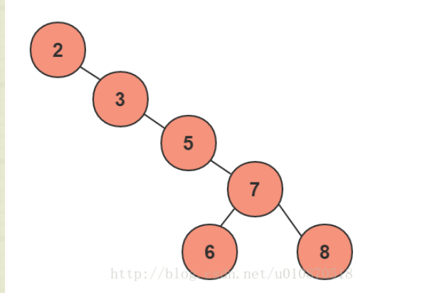
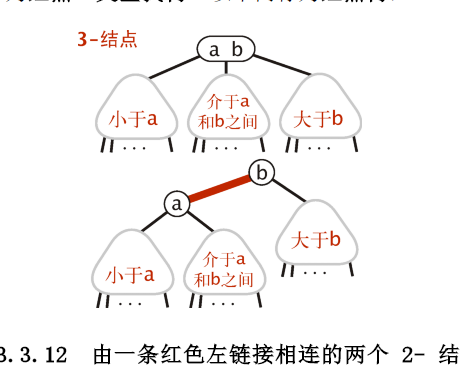
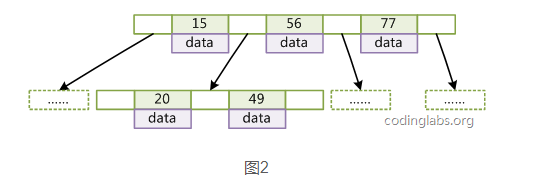

####  二叉查找树 BST
* 任意节点，节点左边所有的值小于等于根节点
* 任意节点，节点右边的值大于根节点

局限性:
某些情况，BST会退化成一个有n个节点的线性链，降低了查找效率，进而引出AVL 平衡二叉查找树  
<!--more-->


#### 平衡二叉查找树 AVL
* 满足二叉查找树的条件
* 任意节点，左右子树的高度差不超过1
* 因为每次删除或者插入，都要通过旋转保证平衡性
  * 适合插入删除次数少，查找次数多的情况
* 很多时候，并不需要追求全局的平衡性，只要局部平衡性就够了，因此引出红黑树
[AVL树python实现](https://blog.coder.si/2014/02/how-to-implement-avl-tree-in-python.html)


#### 2-3查找树
* 2-节点 定义同BST
* 3-节点 含有两个键和三条链接
  * 左链接指向的键都小于改节点，中链接指向的键都位于两个点之间
* 完全平衡的2-3查找树中所有的空链接到根节点的距离都是相同的


在一棵大小为N的2-3树中，查找和插入操作访问的节点必然不超过lgN个。例如在10亿个节点中一个2-3树的高度仅在19-30之间。最多只需访问30个节点实现10亿个键中进行任意查找和插入的操作。


#### 红黑树
* 针对2-3树的改写，用标准二叉查找树和一些额外信息来表示2-3树。
* 红连接-将两个2节点连接起来构成一个3-节点
* 黑连接-2-3树中的普通连接



红黑树另一种定义
* 红连接均为左链接
* 没有一个节点同时和两条红连接连接
* 树是完美黑色平衡，即任意空链接到root的路径上黑链接数量相同

红黑树是**近似平衡**，通过对颜色进行约束，确保没有一条路径会比其他的路径长两倍。

插入删除次数多的场景，**用红黑树代替AVL树**。

```java
Private class Node
{
    Key key;
    Value val;
    Node left,right;
    int N; // 子树中的节点总数
    boolean color; // 由父节点指向它的连接的颜色
}
```
应用:
* C++的STL中,Map和Set都是红黑树
* Java中的TreeMap
* HashMap底层是数组加链表，链表是散列冲突后，加在链表上。当链表上的节点数超过8个后，就会转换成红黑树，因为红黑树更方便查询。

以上大多数的树都是作为内存中的数据结构。

#### B树/B+树
* B树和B-树是一致的。MySQL中的数据一般是放在磁盘中，读取数据会涉及访问磁盘的操作。其中定位数据在磁盘中的哪一块是一个很耗时的工作。  

* **B/B+树是N叉平衡树**(平衡多路查找树)，每个节点可以有更多的孩子，新的值可以插在已有的节点里，而不改变树的高度，从而大量减少重新平衡和数据迁移的次数。适合做db索引这种需要持久化在磁盘，同时需要大量查询和插入操作的应用。

* B/B+树上操作时间由读取磁盘时间和CPU计算时间构成，B树操作效率主要取决于访问磁盘的次数。

* B+树应文件系统(文件的目录一级一级索引，但只有最底层的叶子结点(文件)保存数据,非叶子节点只存索引

* B+树比B树更适合db索引
  *  B+树的**磁盘读写代价更低**：B+树的内部节点并没有指向关键字具体信息的指针，因此其内部节点相对B树更小，如果把所有同一内部节点的关键字存放在同一盘块中，那么盘块所能容纳的关键字数量也越多，一次性读入内存的需要查找的关键字也就越多，**相对IO读写次数**就降低了。
  * **B+树的查询效率更加稳**定：由于非终结点并不是最终指向文件内容的结点，而只是叶子结点中关键字的索引。所以任何关键字的查找必须走一条从根结点到叶子结点的路。所有关键字查询的路径长度相同，导致每一个数据的查询效率相当。
  * 由于B+树的数据都存储在叶子结点中，**分支结点均为索引**，方便扫库，只需要扫一遍叶子结点即可，但是B树因为其分支结点同样存储着数据，我们要找到具体的数据，需要进行一次中序遍历按序来扫，所以B+树**更加适合在区间查询**的情况，所以通常B+树用于数据库索引。
  
* B树和B+树的区别

  * B树如下

  * 

  * B+树如下

  * 

  * B+Tree比B-Tree更适合实现外存储索引结构

  * 与B-Tree相比，B+Tree有以下不同点：

    * 每个节点的指针上限为2d而不是2d+1。

    * 内节点不存储data，只存储key；叶子节点不存储指针

  * 

    * 带有顺序访问指针的B+Tree 要查询key为从18到49的所有数据记录，当找到18后，只需顺着节点和指针顺序遍历就可以一次性访问到所有数据节点，极大提到了区间查询效率

以上的树都是有序的，因此在有数据库索引的情况下，order by索引的值速度会特别快，因为只是在遍历树。

[参考](http://blog.codinglabs.org/articles/theory-of-mysql-index.html)


#### Trie树

* Trie并不是平衡树，也不一定非要有序
* 主要用于前缀匹配，比如字符串，比如说ip地址，如果字符串长度是固定或者说有限的，那么Trie的深度是可控制的，你可以得到很好的搜索效果


#### 面试题
* 红黑树与B+树区别
  * 应用场景不同
  * 一个是二叉，一个是N叉
  * 相同节点下，B+树高度远小于红黑树,因此索引用B+不是红黑
  * Map底层用红黑不是B+的原因，在数据量不大的情况下，用B+树，数据都会挤在一个结点里，这时候查找效率就退化成链表了。

#### 重建二叉树

---

给定二叉树的前序，中序遍历结果，重建二叉树

* 前序结果，第一个节点总是根节点的值, 根据该值在中序遍历结果找到对应的位置，进而找到左右子树的节点数目。
  * 前序: **1** 2 4 7 3 5 6 8，中序 4 7 2 **1** 5 3 8 6 -> 左子树三个节点，右子树四个节点
  * 2 4 7  4 7 2   |   3 5 6 8  5 3 8 6


#### 二叉树的下一个节点

---

给定一个二叉树和其中的一个结点，请找出中序遍历顺序的下一个结点并且返回。注意，树中的结点不仅包含左右子结点，同时包含指向父结点的指针。

* 若该节点有右子树，找到该右子树的最左端

* 若该节点没有右子树，找到该节点的父节点

  * 若该节点是父节点的左节点,打印父节点

  * 若该节点是父节点的右节点, 借助父节点指针往上，一直到找个节点是其父节点的左节点为止


#### 树的子结构

---

输入两棵二叉树A,B，判断B是不是A的子结构

* 递归


#### 二叉树的镜像

---

输入一颗二叉树，输出其镜像

* 前序遍历树的每个节点，如果遍历到的节点有子节点，交换其两个子节点


#### 对称的二叉树

---

先前序遍历得到一个结果。

然后自定义一种遍历算法，先看父节点，再看父节点的右节点，再看父节点的左节点

##### recurisve way

```java
public boolean isSymmetric(TreeNode root) {
    if (root == null) return true;
    return isSymmetricHelper(root.left,root.right);

}

private boolean isSymmetricHelper(TreeNode left, TreeNode right) {
    if (left == null && right == null) return true;
    if (left == null || right == null) return false;
    if (left.val != right.val) return false;
    return isSymmetricHelper(left.left,right.right) && isSymmetricHelper(left.right,right.left);
}
```

##### iterative way

```java
public boolean isSymmetric(TreeNode root) {
    if (root == null) return true;
    Stack<TreeNode> stack =  new Stack<TreeNode>();
    stack.push(root.left);
    stack.push(root.right);

    while (!stack.isEmpty()) {
        TreeNode n1 = stack.pop();
        TreeNode n2 = stack.pop();
        if (n1 == null && n2 == null) continue;
        if (n1 == null || n2 == null || n1.val != n2.val) return false;
        stack.push(n1.left);
        stack.push(n2.right);
        stack.push(n1.right);
        stack.push(n2.left);
    }
    return true;
}
```


#### 树的高度

##### bottom up

---

```python
def maxDepth(self, root):
    if root is None:
        return 0
    left = self.maxDepth(root.left)
    right = self.maxDepth(root.right)
    return max(left , right) + 1
```

##### top down

```python
answer = 0
def maxDepth(self, root):
    """
    :type root: TreeNode
    :rtype: int
    """
    def find_depth(root,depth):
        if root is None:
            return
        if root.left is None and root.right is None:
            self.answer = max(self.answer,depth)
            find_depth(root.left,depth+1)
            find_depth(root.right,depth+1)
            find_depth(root,1)
            return self.answer

```

#### 树的path sum (root到leave)

```java
// recursive
public boolean hasPathSum(TreeNode root, int sum) {
    if (root == null) return false;
    if (root.left == null && root.right == null)
        return sum == root.val;
    return hasPathSum(root.left,sum-root.val) || hasPathSum(root.right,sum-root.val); 
}
```

```java
// iterative
public boolean hasPathSum(TreeNode root, int sum) {
    Stack <TreeNode> stack = new Stack<> ();	    
    stack.push(root) ;	    
    while (!stack.isEmpty() && root != null){
        TreeNode cur = stack.pop() ;	
        if (cur.left == null && cur.right == null){	    		
            if (cur.val == sum ) return true ;
        }
        if (cur.right != null) {
            cur.right.val = cur.val + cur.right.val ;
            stack.push(cur.right) ;
        }
        if (cur.left != null) {
            cur.left.val = cur.val + cur.left.val;
            stack.push(cur.left);
        }
    }	    
    return false ;
}
```


#### 平衡二叉树

---

思路 

* 对每个node的左右子树分别调用上述求高度的公式，然后判断左右子树的高度之差是否大于1
  * 复杂度 O(Nlog(N))
* 修改计算高度的函数
  * 计算高度本身也是递归，因此在该函数里就可以判断 左右子树高度之差是否大于1
  * O(N) 复杂度

```python
    def TreeDepth(self, pRoot):
        # write code here
        if not pRoot:
            return 0
        left = self.TreeDepth(pRoot.left)
        right = self.TreeDepth(pRoot.right)
        if abs(left-right) > 1:
            self.flag = False
            #return 0
        return max(left,right) + 1
```


#### [间隔遍历](<https://leetcode.com/problems/house-robber-iii/>)

---

```python
    def rob(self, root):
        """
        :type root: TreeNode
        :rtype: int
        """
        return max(self.helper(root))
    
    def helper(self,root):
        if not root:
            return (0,0)
        
        left = self.helper(root.left)
        right = self.helper(root.right)
        
        # rob the current root now
        now = root.val + left[1] + right[1]
        # don't rob the current root
        later = max(left) + max(right)
        return (now,later)
```


#### [二叉树：输出根节点到叶子的路径](https://leetcode.com/problems/binary-tree-paths/)

```python
result = []
def binaryTreePaths(self, root):
    """
    :type root: TreeNode
    :rtype: List[str]
    """
    self.result = []
    if not root:
        return []

    self.helper(root,str(root.val))
    return self.result
    
def helper(self,node,tmp_path):
    if node.left:
        self.helper(node.left,tmp_path + "->" + str(node.left.val))
    if node.right:
        self.helper(node.right,tmp_path + "->" + str(node.right.val))
    
    if not node.left and not node.right:
        self.result.append(tmp_path)
        return
```
* 非递归的解法就是同时维护“一个node的stack”，和一个对应路径的“stack”


#### Trie树的构建

---


#### 前序中序后序遍历的非递归形式

---

* 前序 root -left -right，后序是 left- right -root, 通过修改前序遍历的顺序为 root-right-left, 然后对结果reverse，就可以得到left-right-root即后序遍历的结果。

* 前序遍历利用stack 的特性，先压右子树再压左子树

* 中序遍历 
  * 每次先找到节点的最左端，往上走一格，然后跳转到right child


#### [完全二叉树的总节点数](<https://leetcode.com/problems/count-complete-tree-nodes/>)

完全二叉树：除了最后一层可能不满，其余都是满的。 要是所有层都是满的，就是满二叉树。

```python
def countNodes(self, root):
    """
    :type root: TreeNode
    :rtype: int
    """
    if not root:
        return 0
    left_len = self.height(root.left)
    right_len = self.height(root.right)
    
    ## last in the right
    if left_len == right_len:
        return 2**left_len -1 + self.countNodes(root.right) + 1
    ## lase in the left
    elif left_len == right_len + 1:
        return 2**right_len -1 + self.countNodes(root.left) + 1
    
def height(self,node):
    cnt = 0
    while node:
        cnt += 1
        node = node.left
    return cnt
```
思路就是找出叶子节点最后一个不满足的位置，对于子树是满二叉树，则直接用公式求节点数目

复杂度就是logN* logN


#### [N个结点的二叉搜索树有多少种组成方式](<https://leetcode.com/problems/unique-binary-search-trees/submissions/>)

递推， 3个节点可以有 左边0个，右边2个，左边一个，右边一个，左2个，右边0个

```python
def numTrees(self, n):
    """
    :type n: int
    :rtype: int
    """
    g = [1,1]
    i = 2
    while len(g) < n+1:
        tmp = 0
        for j in range(1,i+1):
            tmp += g[j-1]*g[i-j]
        g.append(tmp)
        i += 1
    return g[n]
```


#### 树的层级遍历

* 通常需要两个stack来记录前后两层的节点
* 但是可以通过 一个变量记录进入该层之前stack中的节点数，变成只需要一个stack

```java
public List<List<Integer>> levelOrder(TreeNode root) {
    Queue<TreeNode> layer1 = new LinkedList<TreeNode>();
    if (root != null)  layer1.offer(root);
    List<List<Integer>> result = new LinkedList<List<Integer>>();

    while (! layer1.isEmpty()) {
        List<Integer> curr = new ArrayList<Integer>();
        // 记录数目
        int num = layer1.size();
        for (int i = 0; i < num; i++){
            TreeNode node = layer1.poll();
            curr.add(node.val);
            if (node.left != null) layer1.offer(node.left);
            if (node.right != null) layer1.offer(node.right);
        }
        result.add(curr);
    }
    return result;
}
```

