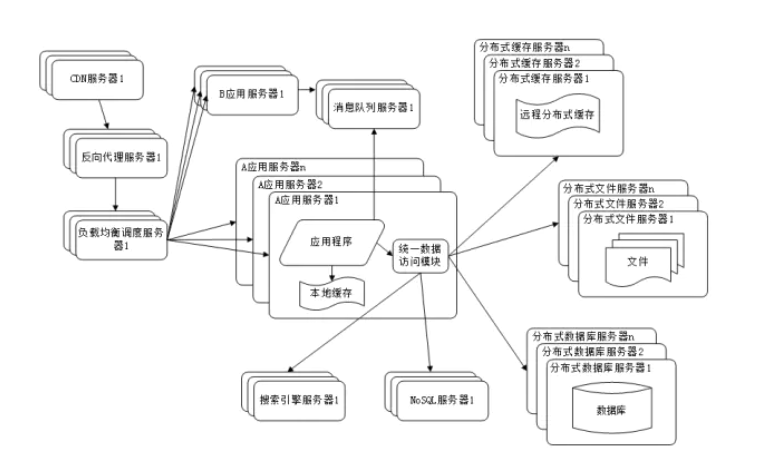

#### 副本 replica
分布式系统对数据和服务提供的一种冗余方式,为了对外提供高可用的服务，我们往往会对数据和服务进行副本处理。
* 数据副本指在不同节点上持久同一份数据，当**某一个节点上存储的数据丢失时，可以从副本上读取到该数据**，这是解决分布式系统数据丢失问题的有效手段。
* 服务副本指多个节点提供同样的服务，每个节点都有能力接受来自外部的请求并进行相应的处理。
<!--more-->

#### 应用服务和数据服务分离
应用和数据分离后整个网站使用 3 台服务器: 应用服务器、文件服务器和数据库服务器。
* 应用服务器业务逻辑，需要**强大的CPU**
* 数据库服务器对磁盘读写操作很多，需要更快的磁盘和更大的内存
* 文件服务器存储用户上传的文件，因此需要更大的磁盘空间

#### 使用缓存改善网站性能
大部分业务访问集中在一小部分数据上，那就把这一小部分数据先提前缓存在内存中，而不是每次都去数据库读取，这样就可以减少数据库的访问压力，从而提高整个网站的访问速度。

网站使用的缓存一般分**为缓存到应用服务器**或者**缓存在专门的分布式缓存服务器**
* 缓存到应用服务器自己的访问速度快很多，但是受自身内存限制
* 远程分布式缓存使用一个集群专门负责缓存服务，当内存不够还可以轻松得动态扩容

#### 应用服务器集群改善网站的并发处理
使用缓存后，数据访问压力得到了缓解，但是单一应用服务器能够**处理的请求连接有**限。

对网站架构而言，只要能通过增加一台服务器的方式改善负载压力，就可以以同样的方式持续增加服务器不断改善系统性能，从而实现系统的可伸缩性。

通过负载均衡调度服务器，可以将来自用户浏览器的访问请求分发到应用服务器集群中的任何一台服务器上。

#### 数据库读写分离
目前大部分的主流数据库都提供**主从热备**功能，通过配置**两台数据库主从**关系，可以将一台数据库服务器的**数据更新同步**到另一台服务器上。

应用服务器**在写数据的时候，访问主数据库**，主数据库通过**主从复制机制将数据更新同步到从**数据库，这样当应用服务器读数据的时候，就可以通过从数据库获得数据。为了便于应用程序访问读写分离后的数据库，通常**在应用服务器端使用专门的数据访问**模块，使数据库读写分离对应用透明

#### 使用反向代理和 CDN 加速网站响应
网站需要加速网站访问速度。主要手段有使用 CDN 和反向代理。
* 反向代理和负载均衡的区别
  * 反向代理，是把一些静态资源存储在服务器上，当用户有请求的时候，就直接返回反向代理服务器上的资源给用户，而如果反向代理服务器上没有的资源，就转发给后面的负载均衡服务
  * 反向代理服务器是需要存储资源的，让用户更快速的接收到资源
  * 负载均衡就是，为了保证后端web服务器的高可用，高并发，是不需要要存储资源，只需要转发用户的请求

#### 分布式文件系统和分布式数据库系统
分布式数据库是网站数据库拆分的最后手段，只有**在单表数据规模非常庞大的**时候才使用。不到不得已时，网站更常用的数据库拆分手段是业务分库，将不同业务的数据部署在不同的物理服务器上。

#### 分布式服务
随着业务拆分越来越小，存储系统越来越庞大，应用系统的整体复杂度呈指数级增加，部署维护越来越困难。由于所有应用要和所有数据库系统连接，在数万台服务器规模的网站中，这些连接的数目是服务器规模的平方，导致数据库连接资源不足，拒绝服务。

既然每一个应用系统都需要执行许多相同的业务操作，比如用户管理、商品管理等，那么可以将这些共用的业务提取出来，独立部署。由这些可复用的业务连接数据库，提供共用业务服务，而应用系统只需要管理用户界面，通过分布式服务调用共用业务服务完成具体业务操作。

### 相关问题
#### 集群部署，分布式session

* 不用session，通过JWT token储存用户身份
* 使用redis，写到redis里面
