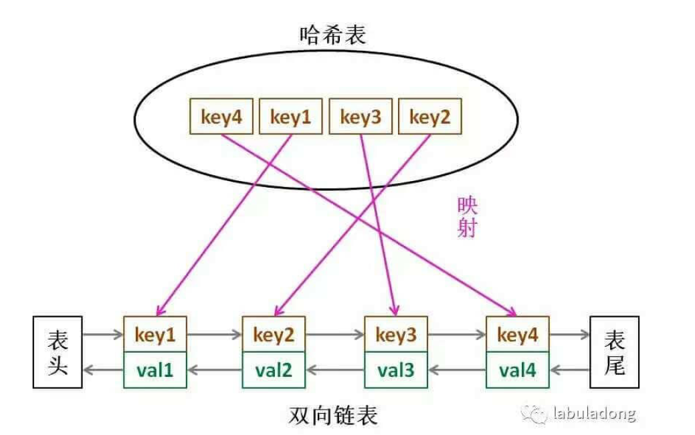

### LRU
least recently used
<!--more-->
* params
  * capacity
* methods
  * put O(1)
  * get  O(1)

* structure
  * 哈希链表 -- 双向链表 + 哈希表



* 双向链表的作用
  * 为了 删除节点时的操作O(1) 需要双向链表直接获得前置节点

* 哈希表的作用
  * 为了O(1)的时间查找到key对应的节点

伪代码

```Java
class Node{
    public int key,val;
    public Node next,prev;
    public Node(int k,int v){
        this.key = k;
        this.val = v;
    }
}

class DoubleList {
	public void addFirst(Node x); // O(1)
    public void remove(Node x); // O(1)
    public Node removeLast(); // O(1)
    public int size();
}


HashMap<Integer,Node> map;
DoubleList cache;

int get(int key){
    if (key 不存在) return -1;
    else {
        将 (key,value)放到开头;
        return value;
    }
}

void put(int key, int val){
    Node x = new Node(key,val);
    if(key 存在){
        删除旧的记录;
        将新节点插入到开头;
    }else{
        if (cache已满){
            删除cache里最后一个节点，并返回该节点;
            然后删除HashMap里的映射记录;
        }
        将节点插入到开头;
        更新HashMap;
    }  
}
```


### LFU
Least Frequently Used

需要存储一个使用频次，当多个key有相同的使用频次的时候(陷入一个 tie)， 可以通过LRU机制来 break tie

* params
  * capacity
* methods
  * put O(1)
  * get  O(1)

* structure
  * 哈希链表 -- 双向链表 + 哈希表


```Java
class Node {
	int key,val,cnt;
	Node prev,next;
	public Node(int key,int val){
		this.key = key;
		this.val = val;
        cnt = 1;
	}
}

class LFUCache {
	public HashMap<Integer,Node> nodeMap; // key 2 node
    public HashMap<Integer,DoubleList> countMap ; // count 2 list
    public int capacity,size,min;
    
	public LFUCache(int capacity){
		this.capacity = capacity;
        nodeMap = new HashMap<>();
        countMap = new HashMap<>();
	}
    
    public int get(int key){
        if (!nodeMap.containsKey(key)) return -1;
        Node node = nodeMap.get(key);
        update(node);
        return node.val;
    }
    
    public void put(int key, int val){
        Node node;
        if (nodeMap.containKeys(key)){
            node = nodeMap.get(key);
            node.val = val;
            update(node);
        } else {
            node = new Node(key,val);
            if (size == capacity){
                DoubleList lastList = countMap.get(min);
            	nodeMap.remove(lastList.removeLast().key);
                size--;
            }
            size++;
            min = 1;
            DoubleList newList = countMap.getOrDefault(node.cnt,new DoubleList());
            newList.add(node);
            countMap.put(node.cnt,newList);
        }
    }
    
    public void update(Node node){
        DoubleList oldList = countMap.get(node.cnt);
        oldList.remove(node);
        
        if (node.cnt == min && oldList.size() == 0) min++;
        node.cnt++;
        DoubleList newList = countMap.getOrDefault(node.cnt,new DoubleList());
        newList.add(node);
       	countMap.put(node.cnt,newList);
    }
}
```


### 访问过的节点处理
* backtrack中经常涉及到是否会走回头路的问题
  * 用一个HashSet添加访问过的节点
  * 把访问过的节点置为False，之后又变回来
    * 例子 [LC 79 word Search](https://leetcode.com/problems/word-search/discuss/?currentPage=1&orderBy=most_votes&query=)
      * 这种二维图的遍历，很难把路径都添加到set中，不如直接把访问过的point置为False


### Trie 树

假设就以26个letter

Time complexity O(1)

Space complexity 

* insert
  * 插入单词
* startsWith
  * 是否存在以给定prefix作为前缀的单词
* search
  * 是否存在该单词

* find
  * 抽离一个方法专门寻找pattern，判断search的结果就是find结果加上判断这个是不是一个完整的词

```python
class Trie(object):
    def __init__(self):
        """
        Initialize your data structure here.
        """
        self.node = {}
    def insert(self, word):
        """
        Inserts a word into the trie.
        :type word: str
        :rtype: None
        """
        t = self.node
        for letter in word:
            if letter not in t:
                t[letter] = {}
            t = t[letter]
        t['#'] = '#'
    def search(self, word):
        """
        Returns if the word is in the trie.
        :type word: str
        :rtype: bool
        """
        state,p = self.find(word)
        return state and ("#" in p)
    def startsWith(self, prefix):
        """
        Returns if there is any word in the trie that starts with the given prefix.
        :type prefix: str
        :rtype: bool
        """
        state,p = self.find(prefix)
        return state
    
    def find(self,pattern):
        p = self.node
        for w in pattern:
            if w in p:
                p = p[w]
            else:
                return False,p
        return True,p

# Your Trie object will be instantiated and called as such:
# obj = Trie()
# obj.insert(word)
# param_2 = obj.search(word)
# param_3 = obj.startsWith(prefix)
```


### 字符修改匹配型

针对一个单词，任意替换某一个char，生成给定词表wordList里的单词，可以先创建一个match dict 

```python
def buildDict(self,wordList):
    from collections import defaultdict
    match = defaultdict(list)
    for word in wordList:
        for i in range(len(word)):
            tmp = word[:i] + "-" + word[i+1:]
            match[tmp].append(word)
    return match
```


