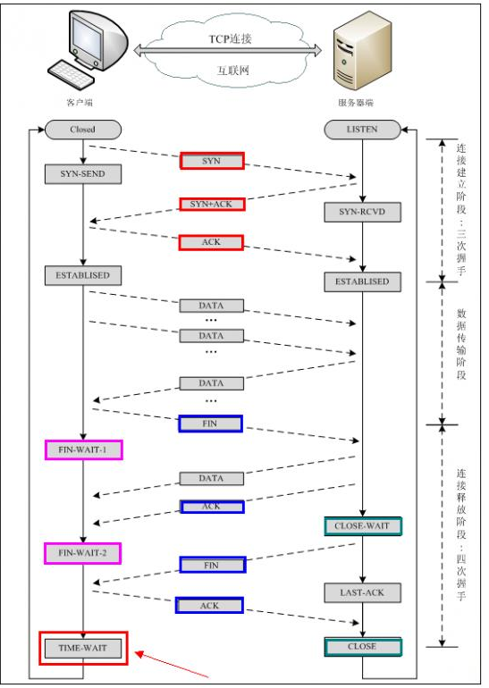

#### IP地址

分为IPv4和IPv6. IPv4一共32位地址, IPv6 128位(32 bytes)， IPv4地址 2^32 已用完。

IP地址分为公网IP和内网IP。 一般通过ipconfig看到的是内网IP，公网IP需要在线查。

内网地址: 类似于 192.168. x. x ， 10. x . x . x

* 两台机器位于同一网络，则他们之间可以直接通信

  * 同一网路- IP地址前段相同，也就是网络号相同

  * 网络号 : IP & network mask

    > ```
    > IP = 101.202.99.2
    > Mask = 255.255.255.0
    > Network = IP & Mask = 101.202.99.0
    > ```

* 对于在不同网络的机器，就要通过路由器或者交换机这种设备(网关)进行通信。

#### 网络模型

OSI(Open system Interconnect) 网络模型是ISO组织定义的， 七层模型。


#### 常用协议

* IP协议
  * 分组协议，不保证可靠传输
  * IP协议只负责分发数据包，不保证顺序和正确性
* TCP协议
  * 传输控制协议，支持可靠传输和双向通信，TCP协议建立在IP协议基础上
  * 很多高级协议 http，SMTP都是建立在TCP协议之上
* UDP协议
  * User Datagram Protocol，数据报文协议， 无连接协议， 不保证可靠传输
  * 通信前不用像TCP那样建立连接，因此传输效率高于TCP协议
  * 选用UDP协议，传输的数据通常容忍丢失，如音频会议


#### TCP 编程

一个应用程序通过一个**socket**来建立远程连接，Socket内部通过TCP/IP协议把数据传输。

Socket、TCP和部分IP的功能都是由操作系统提供的，不同的编程语言只是提供了对操作系统调用的简单的封装

* 用Socket进行网络通信的原因
  
* 仅通过IP地址通信不够，一台PC同一时间会运行多个网络程序，当操作系统接到一个数据包，若只有IP地址，无法判断发给哪个程序
  
* Socket
  * 由IP地址和端口号(0-65535)  -- 端口由OS分配
  * 小于1024的端口属于特权端口，需要管理员权限
* Socket网络编程
  
* 本质是两个进程之间的网络通信，其中一个进程充当服务器端，会主动监听某个指定的端口，另一个进程充当客户端，主动连接上服务器端IP和端口，连接成功后，就建立了TCP连接
  
* TCP的“三次握手”，“四次挥手”  [“三次握手，四次挥手”你真的懂吗？](https://zhuanlan.zhihu.com/p/53374516)

  * 三次握手发生在，建立client和server端之间的连接
    * 双方都能明确自己和对方的数据收，发能力正常
    * 第一次握手，client -> syn -> server  
      * server知道, client能发，server能收
    * 第二次握手,server -> syn + ack -> client
      * client知道，client能收发，server能收发 
    * 第三次握手,  client -> ack -> server
      * server知道，client能收, server能发 结合第一次 知道 双方都能收发
    * 建立连接，开始传输数据
  * 四次挥手发生在，断开client和server端连接
    * 第一次挥手，client  -> fin -> server 告诉server自己要关闭连接了，不再发送数据但可以接收数据
    * 第二次挥手，server ->ack -> client ，表示自己收到client的消息，然后server端上层应用程序也被告知另一端发起关闭操作
    * 第三次挥手，server  -> fin -> client 表示server自己这边也关闭连接
    * 第四次挥手，client  -> cack -> server client告诉server自己收到连接关闭的消息。

  

* 为何关闭连接要四次握手

  * 起初建立连接前，server在listen状态，收到要建立连接的syn报文后，把ack和syn放在一个报文里发送给client
  * 关闭连接时，当收到client的fin时，仅表示client端不再发送数据， 己方(server)是否关闭发送数据通道，需要上层应用决定，因此，FIN和ACK是分开发送的。


####  HTTP 协议

一个http服务器 本质上就是一个TCP服务器

* http1.0
  * browser 每次建立TCP连接后，只发送一个http请求并接受一个http 响应，然后就关闭TCP连接
* http1.1
  * 允许server和browser在同一个TCP连接上反复传送，接受多个HTTP请求响应
  * 由于创建一个TCP连接本身需要一定时间
* http2.0
  * http协议是请求-响应协议，总是发送一个请求，接受一个响应
  * http2.0允许browser同时发出多个请求，但每个请求需要有唯一标识，服务器可以不按请求的顺序返回多个响应。
  * 提高传输效率，因为browser在发出一个请求后，不必等待响应，就可以继续发下一个请求
* http3.0
  * 为提升速度，抛弃TCP协议，改为使用无需创建连接的UDP协议


#### http连接和socket连接

* http连接是“请求-- 响应模式”,  请求前先需要建立连接，还需要客户端向服务器发出请求，服务器才能回复数据

* socket 连接是 服务器端可以主动推数据给客户端来保持客户端与服务器数据的实时同步

TCP 单纯建立连接，不涉及任何我们需要请求的实际数据，简单的传输 -- 传输层

http 用来收发数据， 实际应用上， 属于应用层


#### Web服务器

* 完整的功能 (HTTP/1.1 为例)
  * 识别正确/错误的 HTTP请求
  * 识别正确/错误的HTTP头
  * 复用TCP连接
  * 复用线程
  * IO异常处理

* 通过py代码可以构建一个web服务器
  * 覆写 do_GET / do_POST 等函数来处理request

* 但不希望每次给server增加新功能时，都是在server源码里修改
  * 如果程序能独立在另一个脚本文件运行，就是说每次加一个新功能都是新建一个py脚本，然后加在这个里面，然后server也能同步增加上这个功能。
  * 通过CGI 实现

##### CGI

* CGI即**通用网关接口**(Common Gateway Interface)，是**外部应用程序**（CGI程序）与**Web服务器之间的接口**标准，是在CGI程序和Web服务器之间传递信息的规程。
* 允许Web服务器**执行外部程序**，并将它们的输出发送给Web浏览器
* CGI方式在遇到连接请求（用户请求）先要创建cgi的子进程，激活一个CGI进程，然后处理请求，处理完后结束这个子进程。这就是fork-and-execute模式
* 用cgi方式的服务器有多少连接请求就会有多少cgi子进程，**子进程反复加载**是cgi性能低下的主要原因。当用户请求数量非常多时，会大量挤占系统的资源如内存，CPU时间等，造成效能低下。

CGI脚本工作流程：

1. 浏览器通过HTML表单或超链接请求指向一个CGI应用程序的URL。
2. 服务器收发到请求。
3. 服务器执行所指定的CGI应用程序。
4. CGI应用程序执行所需要的操作，通常是基于浏览者输入的内容。
5. CGI应用程序把结果格式化为网络服务器和浏览器能够理解的文档（通常是HTML网页）。
6. 网络服务器把结果返回到浏览器中。

##### Servlet

JavaEE提供servelet处理HTTP请求。

* 继承HttpServlet，**覆写doGet()或doPost()**
* doGet 传入HttpServeletRequest  和 HttpServletResponse两个对象， 对应请求和响应
* 使用Servlet ApI，并不直接与底层TCP交互，不需要解析HTTP协议
* 支持Servlet API 的Web服务器 
  * Tomcat, Jetty , GlassFish
* Servlet 容器中运行的servlet
  * 无法在代码中直接通过new创建servlet实例，必须由servlet容器自动创建servlet实例
  * servlet容器只会给每个servlet类创建唯一实例
  * servlet容器会使用多线程执行doGet() 或doPost()
* 重定向和转发
  * 重定向 redirect
    * 指当浏览器请求一个URL时, 服务器返回一个重定向指令，告诉浏览器地址已经变了，麻烦**使用新的URL重新发送新**请求 -- 相当于有两次HTTP请求
    * 302 临时重定向，301永久重定向，301，浏览器会缓存/hi到/hello这个重定向的关联，下次请求/hi，浏览器直接发送/hello请求
  * 转发 forward
    * 内部转发，发生在服务器内部

##### JSP

JSP- java server pages，整个文件与html无太大区别，后缀是.jsp，需要插入变量，或动态输出的地方用 <% ... %>

* <%--  --%> 之间是jsp注释
* <% %>之间是java代码
* <%=  xxx %> 可以快捷输出一个变量的值

* JSP 执行前首先被编译成一个Servlet，JSP本质就是一个servlet，但无需配置映射路径，web server 根据路径查找对应的jsp 文件


##### MVC开发

* servlet 适合编写java代码，但不适合输出复杂的html
* jsp适合编写html，并在其中插入动态内容，但不适合写复杂java代码


* MVC - M(model) , V(view), C(controller)
  * C - 业务逻辑
  * M- 数据模型
  * V - 渲染视图


#### 同源策略 same-origin policy

* 允许来自同一站点的资源进行相互访问而不受限制，但会阻止其他不同站点对文档/资源的访问。
* 同源的文档必须有相同的**协议，主机名和端口号**
* 作用是可以防范会话劫持

#### 跨域资源共享

CORS 是一种机制，允许我们绕过同源策略，从一个域名向另一个域名的资源发起请求.

* 原理是添加新的HTTP头部，来对一些域名授权，那这些域名就可以发起对本页面的资源的请求。