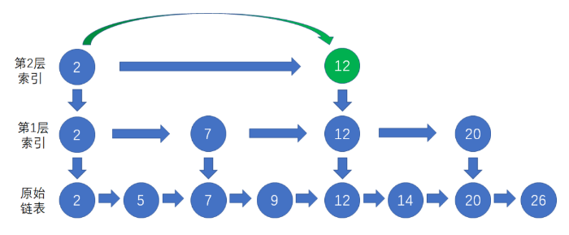

有序链表的查找，可以利用跳表的减少时间复杂度。

<!--more-->

假设原始链表有n个结点，那么索引的层级就是log(n)-1，在每一层的访问次数是常量，因此查找结点的平均时间复杂度是**O（logn）**。这比起常规的查找方式，也就是线性依次访问链表节点的方式，效率要高得多。

基于链表的优化增加了额外的空间开销。假设原始链表有n个结点，那么各层索引的结点总数是n/2+n/4+n/8+n/16+......2，约等于n。

#### 新节点的插入

* 先按照索引一步步往下，找到待插入节点的前置节点(仅小于待插入节点)
* 按照一般链表插入方式，把待插入节点，插入前置节点之后
* 调整索引 -- 让新插入的节点 随机晋升，也就是成为索引节点，成功后仍有机会向上一层晋升，失败后，插入结束

#### 旧节点删除

* 先按照索引，找到要删除的节点
* 然后把原始链表，索引层中的这个节点都删除

[参考  附有跳表实现的代码](https://mp.weixin.qq.com/s/-1_jchMgIVeUdDhlTQCnnA)

